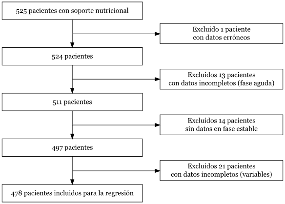

```{r setup, include=FALSE}
library(knitr)

opts_chunk$set(echo = FALSE,
               warning = FALSE,
               message = FALSE,
               comment = "", 
               cache = TRUE,
               tidy = TRUE,
               prompt = FALSE,
               tidy.opts = list(width.cutoff = 72),
               fig.width = 7,
               fig.height = 4.5)

options(width = 75)

Sys.setlocale("LC_TIME", "C")

```

```{r}
# ---- PAQUETES Y LIBRERÍAS ----

#' Instalación de paquetes
#' 
#' @description
#' Comprueba si los paquetes de una lista están instalados en el sistema. Si alguno no lo está, lo instala automáticamente.
#'
#' @param pkg Vector de caracteres con los nombres de los paquetes.
#'
#' @returns No devuelve ningún valor.
#' 
#' @importFrom utils install.packages
#' @export
#'
#' @examples
#' \dontrun{
#' # Ejemplo de uso con datos hipotéticos
#' install_if_not(paquetes)
#' }
install_if_not <- function(pkg) {
  for (p in pkg) {
    if (!requireNamespace(p, quietly = TRUE)) {
      install.packages(p, dependencies = TRUE)
    }
  }
}

# Lista de paquetes e instalación
paquetes <- c(
  "haven", "tidyverse", "nortest", "rstatix", "ggpubr", "ggalluvial", "ggvenn",
  "viridisLite", "patchwork", "gtsummary", "DiagrammeR", "DiagrammeRsvg",
  "rsvg", "survival", "survminer", "car", "caret", "glmnet"
)

install_if_not(paquetes)

rm(paquetes)

```

```{r}
# Gestión de datos y archivos
library(haven)
library(tidyverse)

# Estadística y gráficos
library(nortest)
library(rstatix)
library(ggpubr)
library(ggalluvial)
library(ggvenn)
library(viridisLite)
library(patchwork)

# Tablas
library(gtsummary)
library(DiagrammeR)
library(DiagrammeRsvg)
library(rsvg)

# Análisis de supervivencia
library(survival)
library(survminer)
library(car)
library(caret)
library(glmnet)


```

# Material y métodos

## Análisis estadístico

Los datos se expresan como medias y desviaciones estándar (DE), medianas [rango intercuartil (RIC)] o números y porcentajes, según sea adecuado. Los resultados de los indicadores se presentan como porcentajes e intervalos de confianza (IC) al 95%. Cuando el estándar de referencia es el 100%, no tiene sentido realizar contrastes de hipótesis porque, al comparar con el objetivo ideal, siempre se obtendrá significación. En los casos en los que el índice de masa corporal (IMC) es superior a 30, se utiliza el peso ajustado para los cálculos. Este se puede calcular a partir de las siguientes fórmulas @singer2019:

$$\mathrm{Peso\ ajustado} = (\mathrm{Peso\ actual} - \mathrm{Peso\ ideal}) \cdot 0,33 + \mathrm{Peso\ ideal}$$
$$\mathrm{Peso\ ideal} = 25 \cdot \mathrm{talla}^2$$

Para las comparaciones entre dos grupos se han usado pruebas $t$ de Student y $U$ de Mann_whitney, así como pruebas $\chi^2$ o tests exactos para la evaluación de las variables categóricas. En el caso de las comparaciones entre más de dos grupos, se ha utilizado análisis de la varianza (ANOVA, por su acrónimo en inglés) con correcciones *post-hoc* o la prueba de Kruskal-Wallis. En todos los casos, se ha evaluado la normalidad de la distribución muestral mediante la prueba de Kolmogórov-Smirnov. 

El análisis de supervivencia se ha llevado a cabo utilizando el estimador de Kaplan-Meier para cada subgrupo. En el análisis multivariante subsiguiente se ha empleado un modelo escalonado hacia atrás (*backward stepwise selection*) de regresión de Cox para evaluar la mortalidad a los 28 días. Se han incluido variables en el modelo inicial con un valor $p < 0,2$ en el análisis univariante, así como covariables que se han considerado de relevancia clínica (e.g. edad, sexo, tipo de paciente o gravedad). Se ha empleado un algoritmo de selección automática basado en el valor p y en el criterio de cambio en las estimaciones (*change in estimates*) con un umbral de corte del 10% para excluir variables del modelo final. Posteriormente al diagnóstico del modelo de regresión, se han eliminado variables con coeficiente de correlación de Spearman superior a 0,7 o que no cumplían la hipótesis de riesgos proporcionales para asegurar la robustez del modelo estadístico.

Los análisis estadísticos se han llevado a cabo con el programario R (versión 4.6.0). Se ha considerado significativo un valor $p < 0,05$ bilateral, salvo que se indique lo contrario.

# Resultados

```{r}
# ---- PREPARACIÓN DE LOS DATOS ----

# Carga de datos
datos <- read_sav("ENPIC_BMI_525.sav")

datos <- datos %>% 
  # Exclusión de registros erróneos
  filter(NUTRIC_Score <= 9 | is.na(NUTRIC_Score)) %>%
  
  # Corrección de errores
  mutate(
    FINICNPT2 = if_else(IDICOMEP == 4007, FINICNPT2 - years(90), FINICNPT2),
    FFINNPT2 = if_else(IDICOMEP == 4007, FFINNPT2 - years(90), FFINNPT2),
    
    TIPO_SN_Grupo = if_else(IDICOMEP %in% c(34006, 34007), 3, TIPO_SN_Grupo)
  )

```

## Caracterización de la muestra

La base de datos del estudio contenía registros de 525 pacientes. Después de filtrar por datos erróneos o incompletos, se incluyeron en la muestra final datos de 524 pacientes. En la **Tabla 1** se muestran sus características basales junto con detalles de la terapia nutricional recibida y resultados clínicos. Por otro lado, en el **Anexo I** se incluyen gráficos adicionales con la distribución de características relevantes de la muestra, como la puntuación en la escala NUTRIC Score (**Fig. E1A**) y el valor de IMC (**Fig. E1B**).

```{r}
# ---- RESULTADOS ----

#' Caracterización de la muestra
#' 
#' @description
#' Crea una tabla automatizada con los datos expresados en función del tipo de variable y de su distribución.
#'
#' @param datos Un \code{data.frame} o \code{tibble} que contiene los datos.
#' @param comparar Cadena de texto (opcional). El nombre de la variable de comparación.
#' @param excluir Cadena de texto (opcional). Los nombres de las variables a excluir.
#'
#' @returns Un objeto \code{tbl_stack}.
#' 
#' @importFrom dplyr %>% mutate across everything select case_when any_of where colnames setdiff intersect
#' @importFrom gtsummary tbl_summary modify_table_styling add_p bold_p tbl_stack modify_header modify_footnote all_categorical all_continuous all_stat_cols
#' @importFrom nortest lillie.test
#' @importFrom stats na.omit levels as.formula
#' @importFrom haven as_factor
#' @export
#'
#' @examples
#' \dontrun{
#' # Ejemplo de uso con datos hipotéticos
#' caracterizacion_muestra(datos)
#' caracterizacion_muestra(datos, comparar = "SOFA1", excluir = "SOFA_Cat")
#' }
caracterizacion_muestra <- function(datos, comparar = NULL, excluir = NULL) {
  # 1. Selección de variables
  variables <- c(
    "EDAD", "SEXO", "BMI", "ALCOHOL", "AHTA", "ADBTM", "ACARDIOP", "AEPOC",
    "AIRC", "ACIRROSIS", "AINMUNO", "ANEOPLAS", "STATUS3", "APACHEII", "SOFA1",
    "VGSING2", "NUTRIC_Score", "NUTRISCOR2", "HORASIN", "TIPO_SN_Grupo", 
    "SN_Menos48h", "TOTAL_DIAS_SN", "Kcal_14d", "gPROT_14d", "PCOMPLIG", 
    "PVRGM100", "PDANE", "PCLOSTDIF", "PVOMITO", "PBRONCOAS", "PISQUINT", "VM",
    "DIASVM", "NEC_NA", "TRR", "INFRESP", "INFVIA", "DIAS_UCI", "DIAS_HOSP", 
    "MUERTO28"
  )
  
  variables <- setdiff(variables, c(comparar, excluir))
  
  # 2. Bloques
  bloques <- list(
    `Características basales` = c("EDAD", "SEXO", "BMI", "STATUS3"),
    Comorbilidades = c("ALCOHOL", "AHTA", "ADBTM", "ACARDIOP", "AEPOC",
                       "AIRC", "ACIRROSIS", "AINMUNO", "ANEOPLAS"),
    `Estado nutricional` = c("APACHEII", "SOFA1", "VGSING2", 
                             "NUTRIC_Score", "NUTRISCOR2"),
    `Terapia nutricional` = c("HORASIN", "TIPO_SN_Grupo", "SN_Menos48h", 
                              "TOTAL_DIAS_SN", "Kcal_14d", "gPROT_14d"),
    `Complicaciones gástricas` = c("PCOMPLIG", "PVRGM100", "PDANE", "PCLOSTDIF",
                                   "PVOMITO", "PBRONCOAS", "PISQUINT"),
    Resultados = c("VM", "DIASVM", "NEC_NA", "TRR", "INFRESP", "INFVIA",
                   "DIAS_UCI", "DIAS_HOSP", "MUERTO28")
  )
  
  # 3. Etiquetas
  lista_etiquetas <- list(
    EDAD = "Edad (años)", 
    SEXO = "Sexo (Mujer)", 
    BMI = "IMC",
    ALCOHOL = "Enolismo",
    AHTA = "HTA",
    ADBTM = "Diabetes mellitus",
    ACARDIOP = "IAM",
    AEPOC = "EPOC",
    AIRC = "Insuficiencia renal crónica",
    ACIRROSIS = "Cirrosis hepática",
    AINMUNO = "Inmunosupresión",
    ANEOPLAS = "Neoplasia",
    STATUS3 = "Grupo diagnóstico",
    APACHEII = "APACHE II",
    SOFA1 = "SOFA (al ingreso)",
    VGSING2 = "Malnutrición (VGS)",
    NUTRIC_Score = "NUTRIC Score",
    NUTRISCOR2 = "Riesgo nutricional (NUTRIC Score)",
    HORASIN = "Tiempo hasta Soporte Nutricional (h)",
    SN_Menos48h = "Soporte Nutricional precoz (<48h)",
    Kcal_14d = "Media de kcal/kg/día",
    gPROT_14d = "Media de g proteína/kg/día",
    PCOMPLIG = "Cualquier complicación",
    PVRGM100 = "VRG aumentado",
    PDANE = "Diarrea",
    PCLOSTDIF = "Clostridium difficile",
    PVOMITO = "Vómito",
    PBRONCOAS = "Broncoaspiración",
    PISQUINT = "Isquemia mesentérica",
    VM = "Ventilación Mecánica",
    TRR = "Necesidad de TRR",
    DIAS_UCI = "Estancia en UCI (días)", 
    DIAS_HOSP = "Estancia en Hospital (días)"
  )
  
  # 4. Preparación y limpieza de variables
  datos <- datos %>%
    mutate(
      across(
        everything(), ~ 
          {if(inherits(.x, "haven_labelled")) haven::as_factor(.x) else .x}
      )
    ) %>%
    mutate(
      STATUS3 = case_when(
        STATUS3 == "QUIRURGICO" ~ "Quirúrgico",
        STATUS3 == "MEDICO" ~ "Médico",
        STATUS3 == "TRAUMA" ~ "Traumático"
      )
    ) %>%
    select(any_of(variables), any_of(comparar))
  
  # 5. Gestión de variables dicotómicas
  vars_dicot <- c()
  lista_tipos <- list()
  lista_valores <- list()
  
  for (v in variables) {
    if (v %in% colnames(datos)){
      valores_unicos <- na.omit(unique(datos[[v]]))
      
      if (length(valores_unicos) == 2) {
        vars_dicot <- c(vars_dicot, v)
        lista_tipos[[v]] <- "dichotomous"
        lista_valores[[v]] <- levels(datos[[v]])[2]
      }
    }
  }
  
  # 6. Análisis de normalidad
  vars_num <- datos %>% select(where(is.numeric)) %>% colnames()
  vars_cont <- setdiff(vars_num, c(vars_dicot, comparar))
  
  vars_norm <- c()
  vars_no_norm <- c()
  
  for (v in vars_cont) {
    valores <- na.omit(datos[[v]])
    
    if (length(valores) >= 5) {
      if (lillie.test(valores)$p.value >= 0.05) {
        vars_norm <- c(vars_norm, v)
      } else {
        vars_no_norm <- c(vars_no_norm, v)
      }
    } else {
      vars_no_norm <- c(vars_no_norm, v)
    }
  }
  
  # 7. Selección de formatos estadísticos
  lista_stats <- list(all_categorical() ~ "{n} ({p}%)")
  
  if (length(vars_norm) > 0) {
    for (v in vars_norm) {
      lista_stats[[v]] <- "{mean} ± {sd}"
    }
  }
  
  if (length(vars_no_norm) > 0) {
    for (v in vars_no_norm) {
      lista_stats[[v]] <- "{median} [{p25}, {p75}]"
    }
  }
  
  # 8. Subtablas por bloque
  subtablas <- list()
  
  for (nombre_bloque in names(bloques)) {
    vars_bloque <- intersect(bloques[[nombre_bloque]], variables)
    
    if (length(vars_bloque) == 0) next
    
    st <- datos %>%
      select(any_of(vars_bloque), any_of(comparar)) %>%
      tbl_summary(
        by = any_of(comparar),
        missing = "no",
        type = lista_tipos,
        value = lista_valores,
        statistic = lista_stats,
        label = lista_etiquetas,
        digits = list(all_continuous() ~ 1)
      )
    
    if (!is.null(comparar)) {
      st <- st %>% 
        add_p() %>% 
        bold_p(t = 0.05)
    }
    
    subtablas[[nombre_bloque]] <- st
  }
  
  # 9. Tabla final
  tabla <- tbl_stack(subtablas, group_header = names(subtablas))
  
  # 10. Estética
  tabla <- tabla %>%
    modify_header(label = "**Variable**") %>%
    modify_footnote(
      all_stat_cols() ~ 
        "Valores expresados como media ± DE, mediana [RIC] o n (%)"
    ) %>%
    bold_labels()
  
  if (!is.null(comparar)) {
    tabla <- tabla %>%
      modify_header(p.value = "**Valor p**")
  }
  
  return(tabla)
}

tabla_muestra <- caracterizacion_muestra(datos)

tabla_muestra

```

## Análisis de indicadores de calidad

**Identificación de enfermos en riesgo nutricional (100%)**. Todos los pacientes incluidos en el estudio tuvieron una estancia en la UCI superior a 48h. Se valoró el riesgo nutricional con la herramienta NUTRIC Score en 508 de 524 casos (96,95%, IC 94,98-98,18).

```{r}
# ---- I1. Identificación de enfermos en riesgo nutricional ----

resumen_i1 <- datos %>%
  # 1. Filtrado de pacientes con estancia > 48 h
  filter(DIASUCI >= 2) %>% # Todos
  
  # 2. Cálculo del porcentaje y los IC
  summarise(
    Indicador = "1. Riesgo nutricional",
    Numerador = sum(!is.na(NUTRIC_Score)),
    Denominador = n(),
    `Resultado (%)` = round((Numerador / Denominador) * 100, 2),
    `IC 95% (inf – sup)` = 
      sprintf("(%.2f – %.2f)", 
              prop.test(Numerador, Denominador)$conf.int[1] * 100, 
              prop.test(Numerador, Denominador)$conf.int[2] * 100),
    Estándar = "100%"
  )

```

**Valoración del estado nutricional (100%)**. Se realizó la valoración del estado nutricional en 232 de los 232 pacientes con riesgo nutricional (100%, IC 97,97-100). Es necesario tener en cuenta, no obstante, que existen 16 casos en los que no se pudo objetivar el riesgo nutricional mediante el NUTRIC Score y que, por este motivo, no se han incluido en el cálculo.

```{r}
# ---- I2. Valoración del estado nutricional ----

resumen_i2 <- datos %>%
  # 1. Filtrado de pacientes con riesgo nutricional (NUTRIC Score > 5)
  filter(NUTRIC_Score >= 5) %>%
  
  # 2. Cálculo del porcentaje y los IC
  summarise(
    Indicador = "2. Estado nutricional",
    Numerador = sum(!is.na(VGSING2)),
    Denominador = n(),
    `Resultado (%)` = round((Numerador / Denominador) * 100, 2),
    `IC 95% (inf – sup)` = 
      sprintf("(%.2f – %.2f)", 
              prop.test(Numerador, Denominador)$conf.int[1] * 100, 
              prop.test(Numerador, Denominador)$conf.int[2] * 100),
    Estándar = "100%"
  )

```

**Adecuación del aporte calórico y proteico del soporte nutricional (>80%)**. El cumplimiento de los requerimientos nutricionales en los pacientes que alcanzan el 4º día tras el ingreso en la UCI es bajo: 202 de 507 pacientes reciben entre el 80 y el 110% del aporte calórico recomendado (39,84%, IC 35,58-44,26) y 197 de 507 lo cumplen para el aporte proteico (38,86%, 34,62-43,27).

```{r}
# ---- I4. Adecuación del aporte calórico y proteico ----

# Cálculos adicionales
datos <- datos %>%
  mutate(
    # 1. Cálculo del peso ideal y del peso ajustado
    Peso_ideal = 25 * (TALLA^2),
    Peso_ajustado = (PESOACT - Peso_ideal) * 0.33 + Peso_ideal,
    
    # 2. Peso a utilizar según IMC
    Peso_calculo = if_else(BMI < 30, PESOACT, Peso_ajustado),
    
    # 3. Días totales por fase
    Dias_cal_aguda = rowSums(!is.na(pick(num_range("CALORIA", 1:3)))),
    Dias_prot_aguda = rowSums(!is.na(pick(num_range("PROT", 1:3)))),
    Dias_cal_estable = rowSums(!is.na(pick(num_range("CALORIA", 4:14)))),
    Dias_prot_estable = rowSums(!is.na(pick(num_range("PROT", 4:14)))),
    
    # 4. Aporte nutricional acumulado
    Suma_cal_aguda = 
      rowSums(pick(num_range("CALORIA", 1:3)), na.rm = TRUE) / Peso_calculo,
    Suma_prot_aguda = 
      rowSums(pick(num_range("PROT", 1:3)), na.rm = TRUE) / Peso_calculo,
    Suma_cal_estable = 
      rowSums(pick(num_range("CALORIA", 4:14)), na.rm = TRUE) / Peso_calculo,
    Suma_prot_estable = 
      rowSums(pick(num_range("PROT", 4:14)), na.rm = TRUE) / Peso_calculo,
    
    # 5. Media de aporte nutricional
    Media_cal_aguda = if_else(
      Dias_cal_aguda > 0, Suma_cal_aguda / Dias_cal_aguda, NA_real_
    ),
    Media_prot_aguda = if_else(
      Dias_prot_aguda > 0, Suma_prot_aguda / Dias_prot_aguda, NA_real_
    ),
    Media_cal_estable = if_else(
      Dias_cal_estable > 0, Suma_cal_estable / Dias_cal_estable, NA_real_
    ),
    Media_prot_estable = if_else(
      Dias_prot_estable > 0, Suma_prot_estable / Dias_prot_estable, NA_real_
    ),
    
    # 6. Cálculo del objetivo nutricional total
    Obj_cal = (15 * Dias_cal_aguda) + (25 * Dias_cal_estable),
    Obj_prot = (0.8 * Dias_prot_aguda) + (1.3 * Dias_prot_estable),
    
    # 7. Adecuación al objetivo nutricional
    Adecuacion_obj_cal = if_else(
      Obj_cal > 0, (Suma_cal_aguda + Suma_cal_estable) / Obj_cal, NA_real_
    ),
    Adecuacion_obj_prot = if_else(
      Obj_prot > 0, (Suma_prot_aguda + Suma_prot_estable) / Obj_prot, NA_real_
    )
  )

# Aporte calórico
resumen_i4_cal <- datos %>%
  # 1. Filtrado de pacientes con datos en fase estable
  filter(!is.na(Media_cal_estable)) %>%
  
  # 2. Cálculo del porcentaje y los IC
  summarise(
    Indicador = "4a. Aporte calórico",
    Numerador = sum(Media_cal_estable >= (0.8 * 25) & 
                      Media_cal_estable <= (1.1 * 30), na.rm = TRUE),
    Denominador = n(),
    `Resultado (%)` = round((Numerador / Denominador) * 100, 2),
    `IC 95% (inf – sup)` = 
      sprintf("(%.2f – %.2f)", 
              prop.test(Numerador, Denominador)$conf.int[1] * 100, 
              prop.test(Numerador, Denominador)$conf.int[2] * 100),
    Estándar = ">80%"
  )

# Aporte proteico
resumen_i4_prot <- datos %>%
  # 1. Filtrado de pacientes con datos en fase estable
  filter(!is.na(Media_prot_estable)) %>%
  
  # 2. Cálculo del porcentaje y los IC
  summarise(
    Indicador = "4b. Aporte proteico",
    Numerador = sum(Media_prot_estable >= (0.8 * 1.3) &
                      Media_prot_estable <= (1.1 * 1.5), na.rm = TRUE),
    Denominador = n(),
    `Resultado (%)` = round((Numerador / Denominador) * 100, 2),
    `IC 95% (inf – sup)` = 
      sprintf("(%.2f – %.2f)", 
              prop.test(Numerador, Denominador, p = 0.8)$conf.int[1] * 100, 
              prop.test(Numerador, Denominador, p = 0.8)$conf.int[2] * 100),
    Estándar = ">80%"
  )

resumen_i4 <- bind_rows(resumen_i4_cal, resumen_i4_prot)
rm(resumen_i4_cal, resumen_i4_prot)

```

**Nutrición enteral precoz (100%)**. El nivel de adherencia en este caso es notable: 279 de 375 pacientes (74,4%, IC 69,61-78,68) con indicación de nutrición enteral (NE) la reciben durante las primeras 48h de evolución.

```{r}
# ---- I6. Nutrición enteral precoz ----

resumen_i6 <- datos %>%
  # 1. Filtrado de pacientes con NE o NE-NPT e indicación de NE
  filter(TIPO_SN_Grupo %in% c(1, 3), !is.na(INDICA_NE)) %>%
  
  # 2. Cálculo del porcentaje y los IC
  summarise(
    Indicador = "6. NE precoz",
    Numerador = sum(SN_Menos48h == 1),
    Denominador = n(),
    `Resultado (%)` = round((Numerador / Denominador) * 100, 2),
    `IC 95% (inf – sup)` = 
      sprintf("(%.2f – %.2f)", 
              prop.test(Numerador, Denominador)$conf.int[1] * 100, 
              prop.test(Numerador, Denominador)$conf.int[2] * 100),
    Estándar = "100%"
  )

```

**Uso adecuado de nutrición parenteral total (>90%)**. Existe indicación de nutrición parenteral total (NPT) en 132 de los 193 pacientes (68,39%, IC 61,26-74,78) que reciben NPT.

```{r}
# ---- I7. Uso adecuado de NPT ----

resumen_i7 <- datos %>%
  # 1. Filtrado de pacientes que reciben NPT
  filter(!is.na(FINICNPT2)) %>%
  
  # 2. Cálculo del porcentaje y los IC
  summarise(
    Indicador = "7. NPT adecuada",
    Numerador = sum(!is.na(INDICA_NTP) | !is.na(INDICA_NTP_PocoAporte)),
    Denominador = n(),
    `Resultado (%)` = round((Numerador / Denominador) * 100, 2),
    `IC 95% (inf – sup)` = 
      sprintf("(%.2f – %.2f)", 
              prop.test(Numerador, Denominador, 0.9)$conf.int[1] * 100, 
              prop.test(Numerador, Denominador, 0.9)$conf.int[2] * 100),
    Estándar = ">90%"
  )

```

**Adecuación temporal del inicio de la nutrición parenteral complementaria (>90%)**. Solo 10 de 163 pacientes (6,13%, IC 3,15-11,30) con NE que al 4º día no alcanzan al menos el 60% de los requerimientos nutricionales (15 kcal/kg/día y 0,8 g/kg/día) reciben nutrición parenteral complementaria (NPC) durante las 24 horas posteriores a la detección.

```{r}
# ---- I8. Adecuación temporal de la NPC ----

datos_npc <- datos %>%
  # 1. Pacientes con NE o NE-NPT y valores registrados del 4º día 
  filter(TIPO_SN_Grupo %in% c(1, 3), !is.na(CALORIA4), !is.na(PROT4)) %>%
  
  # 2. Pacientes con <60% del aporte nutricional
  filter(CALORIA4 < (15 * Peso_calculo) | PROT4 < (0.8 * Peso_calculo)) %>%
  
  # 3. Tiempo hasta inicio de NPC
  mutate(
    FINICNE2 = parse_date_time(FINICNE2,
                               orders = c("ymd HMS", "ymd HM", "ymd"),
                               tz = "UTC"),
    FINICNPT2 = parse_date_time(FINICNPT2,
                                orders = c("ymd HMS", "ymd HM", "ymd"),
                                tz = "UTC"),
    dias_npc = as.numeric(difftime(FINICNPT2, FINICNE2, units = "days"))
  )
  
# Cálculo del porcentaje y los IC
resumen_i8 <- datos_npc %>%
  summarise(
    Indicador = "8. NPC adecuada",
    Numerador = sum(dias_npc <= 5, na.rm = TRUE),
    Denominador = n(),
    `Resultado (%)` = round((Numerador / Denominador) * 100, 2),
    `IC 95% (inf – sup)` = 
      sprintf("(%.2f – %.2f)", 
              prop.test(Numerador, Denominador, 0.9)$conf.int[1] * 100, 
              prop.test(Numerador, Denominador, 0.9)$conf.int[2] * 100),
    Estándar = ">90%"
  )

```

**Monitorización de la nutrición enteral (100%)**. La monitorización de la NE es correcta en 101 de los 443 pacientes que reciben NE (22,8%, IC 19,03-27,05).

```{r}
# ---- I9. Monitorización de la NE ----

datos_monitorizacion <- datos %>%
  # 1. Filtrado de pacientes con NE
  filter(!is.na(FINICNE2)) %>%
  
  # 2. Registro de complicaciones
  mutate(
    Reg_comp = if_else(
      !is.na(PVRGM100) & !is.na(PDANE) & !is.na(PCLOSTDIF) & 
        !is.na(PVOMITO) & !is.na(PBRONCOAS) & !is.na(PISQUINT), 
      1, 0, missing = 0
    )
  ) %>%
  
  # 3. Cumplimiento de controles
  mutate(
    # Triglicéridos
    Reg_trig = case_when(
      TIPO_SN_Grupo %in% c(1, 3) & TOTALNE2 >= 14 ~ 
        !is.na(TRIGLI7) & !is.na(TRIGLIA),
      TIPO_SN_Grupo %in% c(1, 3) & TOTALNE2 < 14 ~ 
        !is.na(TRIGLI7) | !is.na(TRIGLIA),
      TRUE ~ !is.na(TRIGLIA)
    ),
    
    # Colesterol
    Reg_col = case_when(
      TIPO_SN_Grupo %in% c(1, 3) & TOTALNE2 >= 14 ~ 
        !is.na(COLESTER7) & !is.na(COLESTERA),
      TIPO_SN_Grupo %in% c(1, 3) & TOTALNE2 < 14 ~ 
        !is.na(COLESTER7) | !is.na(COLESTERA),
      TRUE ~ !is.na(COLESTERA)
    ),
    
    # Albúmina
    Reg_alb = case_when(
      TIPO_SN_Grupo %in% c(1, 3) & TOTALNE2 >= 14 ~ 
        !is.na(ALBUMIN7) & !is.na(ALBUMINAA),
      TIPO_SN_Grupo %in% c(1, 3) & TOTALNE2 < 14 ~ 
        !is.na(ALBUMIN7) | !is.na(ALBUMINAA),
      TRUE ~ !is.na(ALBUMINAA)
    ),
    
    # Prealbúmina
    Reg_prealb = case_when(
      TIPO_SN_Grupo %in% c(1, 3) & TOTALNE2 >= 14 ~ 
        !is.na(PREALBU7) & !is.na(PREALBUA),
      TIPO_SN_Grupo %in% c(1, 3) & TOTALNE2 < 14 ~ 
        !is.na(PREALBU7) | !is.na(PREALBUA),
      TRUE ~ !is.na(PREALBUA)
    ),
    
    # Perfil hepático
    Reg_perf = case_when(
      TIPO_SN_Grupo %in% c(1, 3) & TOTALNE2 >= 14 ~
        !is.na(FALCALI7) & !is.na(FILIRUB7) & !is.na(GAMGT7) &
        !is.na(GOT7) & !is.na(GPT7) & !is.na(PROTT7) &
        !is.na(FALCALIA) & !is.na(FILIRUBA) & !is.na(GAMGTA) &
        !is.na(GOTA) & !is.na(GPTA) & !is.na(PROTTA),
      TIPO_SN_Grupo %in% c(1, 3) & TOTALNE2 < 14 ~ 
        (!is.na(FALCALI7) & !is.na(FILIRUB7) & !is.na(GAMGT7) &
           !is.na(GOT7) & !is.na(GPT7) & !is.na(PROTT7)) |
        (!is.na(FALCALIA) & !is.na(FILIRUBA) & !is.na(GAMGTA) &
           !is.na(GOTA) & !is.na(GPTA) & !is.na(PROTTA)),
      TRUE ~
        !is.na(FALCALIA) & !is.na(FILIRUBA) & !is.na(GAMGTA) &
        !is.na(GOTA) & !is.na(GPTA) & !is.na(PROTTA)
    )
  ) %>%
  
  # 4. Resumen de la monitorización
  mutate(
    Monitorizacion = if_else(
      Reg_comp == 1 & Reg_trig & Reg_col & Reg_alb & Reg_prealb & Reg_perf,
      1, 0, missing = 0
    )
  )

# Cálculo del porcentaje y los IC
resumen_i9 <- datos_monitorizacion %>%
  summarise(
    Indicador = "9. Monitorización NE",
    Numerador = sum(Monitorizacion == 1),
    Denominador = n(),
    `Resultado (%)` = round((Numerador / Denominador) * 100, 2),
    `IC 95% (inf – sup)` = 
      sprintf("(%.2f – %.2f)", 
              prop.test(Numerador, Denominador)$conf.int[1] * 100, 
              prop.test(Numerador, Denominador)$conf.int[2] * 100),
    Estándar = "100%"
  )

```

**Definición Disfunción Hepática Asociada a la Nutrición Parenteral (<20%)**. De los 101 pacientes que pasan más de 7 días con NP, se excluyen del cálculo 17 registros que no contienen al menos el 50% de los datos en alguno de los controles (día 7 o alta). De los 84 restantes, 75 (89,29%, IC 80,16-94,68) cumplen los criterios de Disfunción Hepática Asociada a la Nutrición Parenteral (DHANP). 

Cabe destacar que la inclusión de pacientes con registros incompletos tiende a infraestimar la incidencia de DHANP. Por otro lado, si se aplica una corrección para tener en cuenta los casos que ya presentaban DHANP al inicio de la NP, la incidencia acumulada es de 20 casos de 26 (76,92%, IC 55,92-90,25).

```{r}
# ---- I12. Disfunción hepática asociada a la NP ----

# Variables de análisis
vars_1 <- c("FALCALI1", "GAMGT1", "FILIRUB1", "GOT1", "GPT1", "INR1")
vars_3 <- c("FALCALI3", "GAMGT3", "FILIRUB3", "GOT3", "GPT3", "INR3")
vars_7 <- c("FALCALI7", "GAMGT7", "FILIRUB7", "GOT7", "GPT7", "INR7")
vars_a <- c("FALCALIA", "GAMGTA", "FILIRUBA", "GOTA", "GPTA", "INRA")

datos_dhanp <- datos %>%
  # 1. Filtrado de pacientes que reciben TN durante al menos 7 días
  filter(TOTALNPT22 >= 7 | (TOTALNE2 >= 7 & TIPO_SN_Grupo == 1)) %>%
  
  # 2. Grupos de TN
  mutate(
    Grupo_TN = if_else(TIPO_SN_Grupo == 1, "NE", "NP")
  ) %>%
  
  # 3. Gestión de valores faltantes
  mutate(
    faltantes_7 = rowSums(is.na(pick(all_of(vars_7)))),
    faltantes_a = rowSums(is.na(pick(all_of(vars_a)))),
    
    reg_ok = case_when(
      TIPO_SN_Grupo %in% c(1, 2, 4) ~ (faltantes_7 <= 3 | faltantes_a <= 3),
      TIPO_SN_Grupo == 3 ~ (faltantes_a <= 3),
      TRUE ~ FALSE
    )
  ) %>%
  
  # 4. Filtro de calidad
  filter(reg_ok == TRUE) %>%
  
  # 5. Pacientes con disfunción hepática según día y grupo
  mutate(
    Colestasis = case_when(
      # Si no tiene ninguna analítica = NA
      TIPO_SN_Grupo %in% c(1, 2, 4) &
        is.na(FALCALI7) & is.na(GAMGT7) & is.na(FILIRUB7) &
        is.na(FALCALIA) & is.na(GAMGTA) & is.na(FILIRUBA) ~ NA,
      !TIPO_SN_Grupo %in% c(1, 2, 4) &
        is.na(FALCALIA) & is.na(GAMGTA) & is.na(FILIRUBA) ~ NA,
      
      # Criterio clínico según el grupo
      TIPO_SN_Grupo %in% c(1, 2, 4) ~
        coalesce(FALCALI7 > 280, FALSE) | coalesce(GAMGT7 > 50, FALSE) |
        coalesce(FILIRUB7 > 1.2, FALSE) | coalesce(FALCALIA > 280, FALSE) |
        coalesce(GAMGTA > 50, FALSE) | coalesce(FILIRUBA > 1.2, FALSE),
      TRUE ~ 
        coalesce(FALCALIA > 280, FALSE) | coalesce(GAMGTA > 50, FALSE) |
        coalesce(FILIRUBA > 1.2, FALSE)
    ),
    
    Colestasis_d1 = case_when(
      is.na(FALCALI1) & is.na(GAMGT1) & is.na(FILIRUB1) ~ NA,
      
      coalesce(FALCALI1 > 280, FALSE) | coalesce(GAMGT1 > 50, FALSE) |
        coalesce(FILIRUB1 > 1.2, FALSE) ~ TRUE,
      TRUE ~ FALSE
    ),
    
    Necrosis = case_when(
      TIPO_SN_Grupo %in% c(1, 2, 4) &
        is.na(GOT7) & is.na(GPT7) & is.na(FILIRUB7) & is.na(INR7) &
        is.na(GOTA) & is.na(GPTA) & is.na(FILIRUBA) & is.na(INRA) ~ NA,
      !TIPO_SN_Grupo %in% c(1, 2, 4) &
        is.na(GOTA) & is.na(GPTA) & is.na(FILIRUBA) & is.na(INRA) ~ NA,
      
      TIPO_SN_Grupo %in% c(1, 2, 4) ~
        ((coalesce(GOT7 > 40, FALSE) | coalesce(GPT7 > 42, FALSE)) &
           (coalesce(FILIRUB7 > 1.2, FALSE) | coalesce(INR7 > 1.4, FALSE))) |
        ((coalesce(GOTA > 40, FALSE) | coalesce(GPTA > 42, FALSE)) &
           (coalesce(FILIRUBA > 1.2, FALSE) | coalesce(INRA > 1.4, FALSE))),
      TRUE ~ 
        (coalesce(GOTA > 40, FALSE) | coalesce(GPTA > 42, FALSE)) &
        (coalesce(FILIRUBA > 1.2, FALSE) | coalesce(INRA > 1.4, FALSE))
    ),
    
    Necrosis_d1 = case_when(
      is.na(GOT1) & is.na(GPT1) & is.na(FILIRUB1) & is.na(INR1) ~ NA,
      
      (coalesce(GOT1 > 40, FALSE) | coalesce(GPT1 > 42, FALSE)) &
        (coalesce(FILIRUB1 > 1.2, FALSE) | coalesce(INR1 > 1.4, FALSE)) ~ TRUE,
      TRUE ~ FALSE
    ),
    
    Mixta = if_else(Colestasis & Necrosis, 1, 0, missing = NA_integer_),
    
    DHANP = if_else(Colestasis | Necrosis, 1, 0, missing = NA_integer_),
    
    DHANP_d1 = if_else(Colestasis_d1 | Necrosis_d1, 1, 0, missing = NA_integer_)
  )

# Resumen de valores faltantes
tabla_na <- datos_dhanp %>%
  filter(TIPO_SN_Grupo != 1) %>%
  
  mutate(
    Total_NA = rowSums(is.na(pick(all_of(c(vars_1, vars_3, vars_7, vars_a)))))
  ) %>%
  
  count(Total_NA, name = "Pacientes") %>%
  mutate(
    Porcentaje = round((Pacientes / sum(Pacientes)) * 100, 2),
    Acumulado = round(cumsum((Pacientes / sum(Pacientes)) * 100), 2)
  )

rm(list = ls(pattern = "^vars"))
  
# Cálculo del porcentaje y los IC
resumen_i12a <- datos_dhanp %>%
  filter(TIPO_SN_Grupo != 1) %>%
  summarise(
    Indicador = "12a. DHANP",
    Numerador = sum(DHANP == 1, na.rm = TRUE),
    Denominador = n(),
    `Resultado (%)` = round((Numerador / Denominador) * 100, 2),
    `IC 95% (inf – sup)` = 
      sprintf("(%.2f – %.2f)", 
              prop.test(Numerador, Denominador, 0.2)$conf.int[1] * 100, 
              prop.test(Numerador, Denominador, 0.2)$conf.int[2] * 100),
    Estándar = "<20%"
  )

resumen_i12b <- datos_dhanp %>%
  filter(TIPO_SN_Grupo != 1, DHANP_d1 != 1) %>%
  summarise(
    Indicador = "12b. DHANP (con corrección)",
    Numerador = sum(DHANP == 1, na.rm = TRUE),
    Denominador = n(),
    `Resultado (%)` = round((Numerador / Denominador) * 100, 2),
    `IC 95% (inf – sup)` = 
      sprintf("(%.2f – %.2f)", 
              prop.test(Numerador, Denominador, 0.2)$conf.int[1] * 100, 
              prop.test(Numerador, Denominador, 0.2)$conf.int[2] * 100),
    Estándar = "<20%"
  )

resumen_i12 <- bind_rows(resumen_i12a, resumen_i12b)
rm(resumen_i12a, resumen_i12b)

```

### Resumen de indicadores

La **Tabla 2** muestra el resumen de los cálculos para cada uno de los indicadores.

```{r}
# ---- Tabla resumen de indicadores ----

tabla_indicadores <- bind_rows(
  resumen_i1, resumen_i2, resumen_i4, resumen_i6,
  resumen_i7, resumen_i8, resumen_i9, resumen_i12
) %>%
  mutate(
    `Resultado (%)` = sprintf("%.2f%%", `Resultado (%)`)
  ) %>%
  
  kable(
    col.names = c("Indicador", "Num.", "Denom.", "Resultado", 
                    "IC 95% (inf – sup)", "Estándar")
  )

tabla_indicadores

rm(list = ls(pattern = "^resumen"))

```

## Análisis del aporte nutricional

El aporte nutricional, como se ha observado con los resultados del indicador 4, es inferior al 80% del valor recomendado en más del 60% de los pacientes. Los pacientes que no llegan a los requerimientos de aporte (tanto calórico como proteico) presentan un IMC mayor ($p < 0,001$) y diferencias basales en el grupo diagnóstico ($p < 0,05$). En el caso del aporte calórico, además, obtienen puntuaciones mayores en la escala SOFA ($p = 0,003$) y presentan un porcentaje menor de malnutrición ($p = 0,012$). No se aprecian otras diferencias en el estado nutricional basal (**Tabla 3**, **Tabla 4**).

Además, el grupo de pacientes con aporte insuficiente tarda más en recibir soporte nutricional ($p \approx 0,02$) e incluye sobretodo pacientes con NE (75% en ambos casos), mientras que el tipo de soporte en el grupo de aporte adecuado es más heterogéneo. En cuanto a los resultados, la estancia en el hospital del primer grupo dura menos días ($p = 0.006$), lo cual se podría relacionar con una mayor tasa de mortalidad en el grupo con aporte proteico insuficiente, aunque este resultado no es estadísticamente significativo.

```{r}
# Características de la muestra por aporte nutricional
tabla_muestra_cal <- datos %>%
  mutate(
    Grupo_cal = factor(
      if_else(Adecuacion_obj_cal < 0.8, 0, 1),
      levels = c(0, 1),
      labels = c("Insuficiente (<80%)", "Adecuado (≥80%)")
    )
  ) %>%
  
  caracterizacion_muestra(comparar = "Grupo_cal", 
                          excluir = c("Kcal_14d", "gPROT_14d"))

tabla_muestra_prot <- datos %>%
  mutate(
    Grupo_prot = factor(
      if_else(Adecuacion_obj_prot < 0.8, 0, 1),
      levels = c(0, 1),
      labels = c("Insuficiente (<80%)", "Adecuado (≥80%)")
    )
  ) %>%
  
  caracterizacion_muestra(comparar = "Grupo_prot", 
                          excluir = c("Kcal_14d", "gPROT_14d"))

tabla_muestra_cal
tabla_muestra_prot

```

A continuación se desglosan los datos por grupos de cumplimiento teniendo en cuenta la media del aporte recibido durante la fase estable (días 4-14). De los pacientes que no cumplen los requerimientos de aporte calórico, 135 (26,63%) no llegan al 60% de los valores recomendados, mientras que 155 (30,57%) se sitúan entre el 60 y el 80%. Por la parte superior, 15 pacientes (2,96%) superan el umbral del 110%. En el caso de las proteínas, 152 pacientes (29,98%) no llegan al 60%, 134 (26,43%) se quedan entre el 60 y el 80% y 24 (4,73%) superan el 110% (**Tabla 5**, **Tabla 6**).

```{r}
#' Análisis del error en el aporte nutricional
#' 
#' @description
#' Clasifica las observaciones en cuatro categorías según un intervalo de
#' referencia y devuelve una tabla formatada con `knitr::kable`.
#'
#' @param datos Un \code{data.frame} o \code{tibble} que contiene los datos.
#' @param columna El nombre de la columna a analizar (sin comillas).
#' @param valor_inf Numérico. Límite inferior del intervalo de referencia.
#' @param valor_sup Numérico. Límite superior del intervalo de referencia.
#' @param etiqueta Cadena de texto (opcional). El nombre de la variable que
#' aparecerá en el título de la tabla. Por defecto es "variable".
#'
#' @returns Una tabla objeto \code{knitr_kable} con el resumen de fercuencias
#' y porcentajes por categoría.
#' 
#' @importFrom dplyr %>% filter mutate case_when group_by summarise n
#' @importFrom knitr kable
#' @export
#'
#' @examples
#' \dontrun{
#' # Ejemplo de uso con datos hipotéticos
#' analisis_aporte(df, media_calorias, 25, 30, "Calorías")
#' }
analisis_aporte <- function(datos, columna, valor_inf, valor_sup, 
                           etiqueta = "variable") {
  
  # Intervalo de referencia
  intervalo_ref <- paste0(valor_inf, " - ", valor_sup)
  
  error <- datos %>%
    # 1. Filtrado de pacientes con datos en la fase de estudio
    filter(!is.na({{ columna }})) %>%
    
    # 2. Casos de error
    mutate(
      Categoria = case_when(
        {{ columna }} < (0.6 * valor_inf) ~ "Hiponutrición (<60%)",
        {{ columna }} >= (0.6 * valor_inf) & {{ columna }} < (0.8 * valor_inf) ~ 
          "Aporte subóptimo (60-80%)",
        {{ columna }} >= (0.8 * valor_inf) & {{ columna }} <= (1.1 * valor_sup) ~ 
          "Aporte adecuado (80-110%)",
        {{ columna }} > (1.1 * valor_sup) ~ "Hipernutrición (>110%)"
        ),
    
      Categoria = factor(Categoria, levels = c(
        "Hiponutrición (<60%)",
        "Aporte subóptimo (60-80%)",
        "Aporte adecuado (80-110%)",
        "Hipernutrición (>110%)"
        ))
      ) %>%
  
    # 3. Resumen
    group_by(Categoria) %>%
    summarise(
      Total_grupo = n(),
      .groups = "drop"
      ) %>%
    mutate(
      Porcentaje = round((Total_grupo / sum(Total_grupo)) * 100, 2)
    )
  
  return(kable(error,
               col.names = c("Categoría", "Recuento", "Porcentaje (%)"),
               caption = paste0(
                 "**", etiqueta, "** | Intervalo de referencia: ", intervalo_ref
               )))
}

# Tablas
tabla_cal_aguda <- analisis_aporte(
  datos = datos, columna = Media_cal_aguda, valor_inf = 15, valor_sup = 20,
  etiqueta = "Aporte calórico en fase aguda (kcal/kg/día)"
)
tabla_cal_estable <- analisis_aporte(
  datos = datos, columna = Media_cal_estable, valor_inf = 25, valor_sup = 30,
  etiqueta = "Aporte calórico en fase estable (kcal/kg/día)"
)
tabla_prot_aguda <- analisis_aporte(
  datos = datos, columna = Media_prot_aguda, valor_inf = 0.8, valor_sup = 1.2,
  etiqueta = "Aporte proteico en fase aguda (g/kg/día)"
)
tabla_prot_estable <- analisis_aporte(
  datos = datos, columna = Media_prot_estable, valor_inf = 1.3, valor_sup = 1.5,
  etiqueta = "Aporte proteico en fase estable (g/kg/día)"
)

tabla_cal_estable
tabla_prot_estable

```

Los gráficos (**Fig. 1**, **Fig. 2**) muestran la progresión del aporte diario para cada categoría. Para la comparación del aporte nutricional entre grupos de riesgo se utiliza el test U de Mann-Whitney-Wilcoxon (**Tabla E1**, **Tabla E2**). No se aplican correcciones por comparaciones múltiples porque en el análisis exploratorio no se observa ningún valor $p < 0,05$. Así, no se puede afirmar que existan diferencias significativas en el aporte nutricional entre los pacientes con riesgo nutricional alto o bajo.

```{r}
#' Progresión del aporte nutricional
#' 
#' @description
#' Calcula la mediana y el rango intercuartílico del aporte nutricional por día
#' y devuelve el gráfico de progresión temporal formatado con `ggplot2`.
#'
#' @param datos Un \code{data.frame} o \code{tibble} que contiene los datos.
#' @param categoria El nombre de la variable a analizar ("CALORIA" o "PROT").
#' @param comparar Muestra la comparación entre dos grupos (FALSE por defecto).
#'
#' @returns Un objeto `ggplot` con la representació visual de la aportación.
#' 
#' @importFrom dplyr %>% select starts_with mutate filter group_by summarise if_else
#' @importFrom tidyr pivot_longer
#' @importFrom ggplot2 ggplot aes geom_ribbon geom_line geom_point annotate scale_color_viridis_c scale_fill_viridis_c scale_x_continuous scale_y_continuous theme_minimal labs
#' @export
#'
#' @examples
#' \dontrun{
#' # Ejemplo de uso con datos hipotéticos
#' progresion_aporte(df, "CALORIA")
#' progresion_aporte(df, "PROT")
#' }
progresion_aporte <- function(datos, categoria, comparar = FALSE) {
  
  # 1. Determinación de variables según la categoría
  caloria <- categoria == "CALORIA"
  variable <- if_else(caloria, "calórico", "proteico")
  unidades <- if_else(caloria, "kcal/kg/día", "g/kg/día")
  
  # 2. Objetivos dinámicos
  fase_aguda <- if_else(caloria, 12, 0.8 * 0.8)
  fase_estable <- if_else(caloria, 20, 0.8 * 1.3)
  
  objetivos <- data.frame(
    x = c(1, 4),
    xend = c(3, 14),
    y = c(fase_aguda, fase_estable),
    Fase = c("Fase aguda", "Fase estable")
  )
  
  # 3. Agrupación dinámica
  grupos <- if (comparar) c("NUTRISCOR2", "Día") else "Día"
  
  # 4. Procesamiento de datos
  datos <- datos %>%
    # 4.1. Recodificación del riesgo nutricional
    mutate(
      NUTRISCOR2 = factor(NUTRISCOR2,
                          levels = c(0, 1),
                          labels = c("Riesgo bajo (NUTRIC Score < 5)",
                                     "Riesgo alto (NUTRIC Score >= 5)"))
    ) %>%
    
    # 4.1. Selección de categoría
    select(any_of("NUTRISCOR2"), Peso_calculo, starts_with(categoria)) %>%
    
    # 4.2. Cálculo del aporte por kg y día
    pivot_longer(
      cols = starts_with(categoria),
      names_to = "Día",
      names_prefix = categoria,
      values_to = "Aporte"
    ) %>%
    mutate(
      Día = as.numeric(Día),
      Aporte = Aporte / Peso_calculo
    ) %>%
    
    # 4.3. Filtraje de NA
    filter(!is.na(Día), !is.na(Aporte))
  
  # 5. Si se comparan grupos, elimina NA
  if (comparar) {
    datos <- datos %>% filter(!is.na(NUTRISCOR2))
  }
  
  # 6. Cálculo de mediana y RIQ por día
  datos <- datos %>%
    group_by(across(all_of(grupos))) %>%
    summarise(
      Mediana = median(Aporte, na.rm = TRUE),
      P25 = quantile(Aporte, 0.25, na.rm = TRUE),
      P75 = quantile(Aporte, 0.75, na.rm = TRUE),
      .groups = "drop"
    )
  
  # 7. Gráfico de progresión temporal
  plot_out <- ggplot(datos, aes(x = Día, y = Mediana)) +
    # 7.1. Sombreado del RIQ
    geom_ribbon(aes(ymin = P25, ymax = P75), 
                fill = viridis(3)[2], alpha = 0.1) +
    
    # 7.2. Línea de tendencia principal y puntos
    geom_line(color = viridis(3)[2], linewidth = 1.2) +
    geom_point(color = viridis(3)[2], size = 3) +
    
    # 7.3. Líneas de objetivo
    geom_segment(data = objetivos,
                 aes(x = x, xend = xend, y = y, yend = y, color = Fase),
                 linetype = "dashed", linewidth = 1) +
    
    # 7.4. Estética
    scale_color_manual(
      name = "Objetivos nutricionales:",
      values = c("Fase aguda" = viridis(3)[1], "Fase estable" = "firebrick")
    ) +
    scale_x_continuous(breaks = 1:14) +
    scale_y_continuous(limits = c(0, max(datos$P75) * 1.1)) +
    theme_minimal() +
    theme(
      panel.grid.minor = element_blank(),
      plot.title = element_text(face = "bold"),
      legend.position = "bottom"
    ) +
    
    # 7.5. Texto y etiquetas
    labs(
      title = paste0("Progresión del aporte ", variable, " diario"),
      subtitle = paste0("Mediana de ", unidades, " con rango intercuartílico"),
      x = "Día",
      y = paste0("Aporte (", unidades, ")"),
      color = "Referencias:"
    )
  
  if (comparar) {
    plot_out <- plot_out + facet_wrap(~NUTRISCOR2)
  }
  
  return(plot_out)
}

# Gráficos
plot_comp_cal <- progresion_aporte(datos, "CALORIA", comparar = TRUE)
plot_comp_prot <- progresion_aporte(datos, "PROT", comparar = TRUE)

plot_comp_cal
plot_comp_prot

```

En cuanto a la distribución de días dentro de los rangos teóricos de aporte nutricional, el porcentaje de días en rango por paciente va del 0 al 100% en todos los casos (**Fig. E2**). Se aprecia una ligera tendencia a la baja en el grupo de riesgo bajo, que es estadísticamente significativa ($p = 0,048$).

Se muestran las tablas de contingencia (**Tabla 7**, **Tabla 8**) para el cambio entre niveles de aporte calórico y proteico entre la fase aguda y la fase estable (se excluyen los pacientes sin datos en alguna de las fases). Para favorecer la interpretación, se ha tenido en cuenta únicamente el umbral del 80% de aporte nutricional y se ha utilizado el test de McNemar para datos apareados.

En ambos casos, el valor $p$ es inferior a 0,001. Así, existe evidencia significativa de asimetría en la dirección del cambio. En las tablas se puede observar una tendencia a pasar de un aporte adecuado en fase aguda a no cumplir los requerimientos en fase estable, siendo mucho menor en sentido inverso.

En el **Anexo I** se incluye un diagrama de aluviones (**Fig. E3**) con un mayor detalle de la dinámica de los grupos de cumplimiento entre las dos fases.

```{r}
#' Tabla de contingencia y test de McNemar
#' 
#' @description
#' Clasifica el aporte nutricional en función del umbral del 80% y genera una tabla de contingencia que muestra la evolución entre fase aguda y fase estable.
#'
#' @param datos Un \code{data.frame} o \code{tibble} que contiene los datos.
#' @param categoria El nombre de la variable a analizar ("CALORIA" o "PROT"). 
#' @param valor_ag Numérico. Valor de corte en fase aguda.
#' @param valor_es Numérico. Valor de corte en fase estable.
#'
#' @returns Una tabla objeto \code{knitr_kable} con los valores absolutos, los porcentajes y el valor p.
#' 
#' @importFrom dplyr %>% mutate if_else
#' @importFrom rlang sym !!
#' @importFrom knitr kable
#' @importFrom stats mcnemar.test prop.table addmargins
#' @export
#'
#' @examples
#' \dontrun{
#' # Ejemplo de uso con datos hipotéticos
#' grupos_aporte(df, "CALORIA", 15, 20)
#' }
grupos_aporte <- function (datos, categoria, valor_ag, valor_es) {
  # 1. Selección de columnas según la categoría
  if (categoria == "CALORIA") {
    col_aguda <- sym("Media_cal_aguda")
    col_estable <- sym("Media_cal_estable")
    variable <- "calórico"
  } else {
    col_aguda <- sym("Media_prot_aguda")
    col_estable <- sym("Media_prot_estable")
    variable <- "proteico"
  }
  
  # 2. Comparación fase aguda - fase estable
  cambio <- datos %>%
    # Grupo de aporte nutricional
    mutate(
      grupo_aguda = if_else(
        !!col_aguda < (0.8 * valor_ag), 
        "Insuficiente (<80%)", "Adecuado (≥80%)"
      ),
      
      grupo_estable = if_else(
        !!col_estable < (0.8 * valor_es), 
        "Insuficiente (<80%)", "Adecuado (≥80%)"
      ),
      
      grupo_aguda = factor(
        grupo_aguda, levels = c("Insuficiente (<80%)", "Adecuado (≥80%)")
      ),
      grupo_estable = factor(
        grupo_estable, levels = c("Insuficiente (<80%)", "Adecuado (≥80%)")
      )
    )
  
  # 3. Estructura de las tablas (valores absolutos y %)
  tabla_abs <- table(cambio$grupo_aguda, cambio$grupo_estable)
  tabla_pct <- prop.table(tabla_abs) * 100
  
  # 4. Test de McNemar
  test <- mcnemar.test(tabla_abs)
  p_valor <- test$p.value
  p_text <- if_else(
    p_valor < 0.001, "p < 0.001", paste0("p = ", round(p_valor, 3))
  )
  
  # 5. Márgenes con totales
  tabla_abs <- addmargins(tabla_abs)
  tabla_pct <- addmargins(tabla_pct)
  
  # 6. Tabla de contingencia
  tabla_cont <- matrix(
    sprintf("%d (%.1f%%)", tabla_abs, tabla_pct),
    nrow = nrow(tabla_abs),
    dimnames = dimnames(tabla_abs)
  )
  
  # 7. Etiquetas
  rownames(tabla_cont)[rownames(tabla_cont) == "Sum"] <- "Total"
  colnames(tabla_cont)[colnames(tabla_cont) == "Sum"] <- "Total"
  
  # 8. Conversión a data frame
  df_tabla_cont <- as.data.frame.matrix(tabla_cont)
  
  df_tabla_cont <- cbind(`Fase Aguda` = rownames(df_tabla_cont), df_tabla_cont)
  rownames(df_tabla_cont) <- NULL
  
  colnames(df_tabla_cont) <- c(
    "Fase Aguda / Fase Estable", "Insuficiente (<80%)", "Adecuado (≥80%)", "Total"
  )
  
  return(kable(df_tabla_cont,
               caption = paste0(
                 "**Evolución de los niveles de aporte ", variable,
                 "** | Test de McNemar: ", p_text
               ),
               align = "lccc"))
}

tabla_evol_cal <- grupos_aporte(datos, "CALORIA", 15, 25)
tabla_evol_prot <- grupos_aporte(datos, "PROT", 0.8, 1.3)

tabla_evol_cal
tabla_evol_prot

```

Por último, en las tablas siguientes (**Tabla 9**, **Tabla 10**) se muestra la distribución por grupos de aporte calórico y proteico al 4º día, que se utiliza para valorar la necesidad de NPC. Solo 19 de los 163 pacientes que no alcanzan el 60% de los requerimientos reciben NPC (**Fig. E4**).

```{r}
# Aporte calórico en el 4º día en NE
tabla_cal_4 <- datos %>%
  filter(TIPO_SN_Grupo %in% c(1, 3), !is.na(CALORIA4), !is.na(PROT4)) %>%
  
  mutate(
    CALORIA4 = CALORIA4 / Peso_calculo
  ) %>%
  
  analisis_aporte(CALORIA4, 25, 30, "Aporte calórico día 4 (kcal/kg/día)")

# Aporte proteico en el 4º día en NE
tabla_prot_4 <- datos %>%
  filter(TIPO_SN_Grupo %in% c(1, 3), !is.na(CALORIA4), !is.na(PROT4)) %>%
  
  mutate(
    PROT4 = PROT4 / Peso_calculo
  ) %>%
  
  analisis_aporte(PROT4, 1.3, 1.5, "Aporte proteico día 4 (g/kg/día)")

tabla_cal_4
tabla_prot_4

```

## Monitorización de la terapia nutricional

En el gráfico (**Fig. 3A**) se muestran los porcentajes de cumplimiento para cada uno de los controles. Para pacientes que iniciaron NE se considera que la monitorización es correcta si existen 2 controles (día 7 y alta) si se mantiene la NE durante 14 días o más o 1 control (día 7 o alta) si se mantiene durante menos de 14 días. Para pacientes que recibieron NPT y posteriormente NE, se considera correcta si existe 1 control al alta.

```{r}
# Cálculo de porcentajes por control
plot_monitorizacion <- datos_monitorizacion %>%
  # Tabla de porcentajes
  summarise(
    Complicaciones = mean(Reg_comp, na.rm = TRUE) * 100,
    Triglicéridos = mean(Reg_trig, na.rm = TRUE) * 100,
    Colesterol = mean(Reg_col, na.rm = TRUE) * 100,
    Albúmina = mean(Reg_alb, na.rm = TRUE) * 100,
    Prealbúmina = mean(Reg_prealb, na.rm = TRUE) * 100,
    `Perfil hepático` = mean(Reg_perf, na.rm = TRUE) * 100
  ) %>%
  
  pivot_longer(
    cols = everything(), names_to = "Control", values_to = "Porcentaje"
  ) %>%
  
  # Gráfico de barras
  ggplot(aes(x = reorder(Control, Porcentaje), 
                                 y = Porcentaje,
                                 fill = Porcentaje)) +
  geom_bar(alpha = 0.7, stat = "identity", show.legend = FALSE) +
  scale_fill_viridis_c(option = "viridis") +
  coord_flip() +
  labs(
    title = "Monitorización de la NE",
    subtitle = "Cumplimiento por caso",
    x = NULL,
    y = "% de cumplimiento"
  ) +
  theme_minimal() +
  theme(
    panel.grid.minor = element_blank(),
    plot.title = element_text(face = "bold")
  ) +
  geom_text(aes(label = paste0(round(Porcentaje, 2), "%")),
            hjust = -0.2, size = 3.5, fontface = "bold") +
  ylim(0, 115)

```

Sobre la DHANP, se incluye un diagrama de Venn (**Fig. 3B**) con la relación entre las 2 categorías. El patrón mayoritario de DHANP es colestásico, con 22 casos (29,3%) de lesión mixta. No se observa ningún caso de necrosis pura.

```{r}
# Diagrama de Venn
plot_dhanp_venn <- list(
  Colestasis = which(datos_dhanp$Colestasis == TRUE & 
                       datos_dhanp$TIPO_SN_Grupo != 1),
  Necrosis = which(datos_dhanp$Necrosis == TRUE & 
                       datos_dhanp$TIPO_SN_Grupo != 1)
) %>%
  
  ggvenn(
    columns = c("Colestasis", "Necrosis"),
    fill_color = viridis(2),
    fill_alpha = 0.3, 
    stroke_color = viridis(2),
    stroke_size = 0.7,
    set_name_size = 4,
    text_size = 3
  ) +
  
  annotate("text", x = 0, y = -1.2, label = "Lesión mixta", size = 4) +
  
  labs(title = "Criterios de DHANP") +
  theme_void() +
  theme(
    plot.title = element_text(face = "bold"),
    legend.position = "none"
  )

(plot_monitorizacion | plot_dhanp_venn) +
  plot_annotation(tag_levels = "A")

```

El gráfico de cajas (**Fig. 4**) muestra la evolución de cada biomarcador en el subconjunto de pacientes que recibe NP durante más de 7 días. Existe una tendencia marcada al alza para la fosfatasa alcalina y la gamma-glutamil transferasa (GGT), mientras que el resto de biomarcadores se mantienen constantes o incluso muestran una tendencia a la baja, como el Índice Internacional Normalizado (INR). Cabe destacar que más del 50% de estos pacientes presentan la GGT por encima del umbral diagnóstico desde el primer día.

No se incluyen los valores de significación estadística debido al elevado número de valores faltantes, que imposibilitan su cálculo adecuado mediante la prueba no paramétrica de Friedman para medidas repetidas.

Si se dividen los casos de DHANP entre prevalencia basal e incidencia acumulada, se obtiene una diferencia significativa en la primera si se compara con los casos que hipotéticamente se diagnosticarían en el grupo com más de 7 días de NE ($p < 0,001$). En cambio, no existen diferencias significativas en la incidencia acumulada entre ambos grupos (**Tabla 11**).

```{r}
# Umbrales diagnósticos
umbrales_dhanp <- data.frame(
  Biomarcador = c("Fosfatasa alcalina", "GGT", "Bilirubina", 
                  "GOT (AST)", "GPT (ALT)", "INR"),
  Corte = c(280, 50, 1.2, 40, 42, 1.4)
)

# Gráfico de distribuciones
plot_dhanp_dist <- datos_dhanp %>%
  # 1. Filtrado de pacientes
  filter(TIPO_SN_Grupo != 1) %>%
  
  # 2. Selección de columnas
  select(starts_with(
    c("FALCALI", "GAMGT", "FILIRUB", "GOT", "GPT", "INR")
  )) %>%
  
  # 3. Conversión a formato largo para ggplot
  pivot_longer(
    cols = everything(),
    names_to = "Clave",
    values_to = "Valor"
  )%>%
  
  # 4. Recodificación
  mutate(
    Biomarcador = str_extract(Clave, "FALCALI|GAMGT|FILIRUB|GOT|GPT|INR"),
    Día = str_extract(Clave, "\\d+|A$"),
    Día = if_else(Día == "A", "Alta", Día),
    Biomarcador = recode_values(Biomarcador,
                                "FALCALI" ~ "Fosfatasa alcalina",
                                "GAMGT" ~ "GGT",
                                "FILIRUB" ~ "Bilirubina",
                                "GOT" ~ "GOT (AST)",
                                "GPT" ~ "GPT (ALT)",
                                "INR" ~ "INR")
  ) %>%
  
  # 5. Filtrado de valores faltantes
  filter(!is.na(Valor)) %>%
  
  # 6. Boxplots
  ggplot(aes(x = Día, y = Valor, fill = Día)) +
  geom_boxplot(alpha = 0.6, outlier.shape = NA) +
  geom_jitter(width = 0.15, alpha = 0.2, size = 0.8) +
  
  # 6.1. Líneas de corte
  geom_hline(data = umbrales_dhanp, aes(yintercept = Corte),
             linetype = "dashed", color = "firebrick", linewidth = 0.8) +
  
  # 6.2. Separación de gráficos por biomarcador
  facet_wrap(~ Biomarcador, scales = "free_y", ncol = 3) +
  
  # 6.3. Estética
  scale_y_log10() +
  scale_fill_viridis_d() +
  labs(
    title = "Evolución de biomarcadores hepáticos en NP",
    subtitle = "Las líneas indican los puntos de corte diagnósticos",
    x = "Control",
    y = "Valor (log10)"
  ) +
  theme_minimal() +
  theme(
    axis.text.x = element_blank(),
    panel.grid.minor = element_blank(),
    plot.title = element_text(face = "bold"),
    legend.position = "bottom",
    strip.text = element_text(face = "bold")
  )

rm(umbrales_dhanp)

plot_dhanp_dist

```

```{r}
# Comparación entre NE y NP

# 1. Datos basales
n_d1 <- datos_dhanp %>% filter(!is.na(DHANP_d1))
t_d1 <- table(n_d1$Grupo_TN, n_d1$DHANP_d1)
p_d1 <- chisq.test(t_d1)$p.value

# 2. Incidencia
n_ev <- datos_dhanp %>% filter(DHANP_d1 == 0 & !is.na(DHANP))
t_ev <- table(n_ev$Grupo_TN, n_ev$DHANP)
p_ev <- chisq.test(t_ev)$p.value

# 3. Tabla de comparación
tabla_dhanp_comp <- data.frame(
  Momento = c("Prevalencia basal", "Incidencia acumulada"),
  
  NE_pos = c(
    paste0(t_d1[1, 2], " (", round(prop.table(t_d1, 1)[1, 2] * 100, 1), "%)"),
    paste0(t_ev[1, 2], " (", round(prop.table(t_ev, 1)[1, 2] * 100, 1), "%)")
  ),
  NE_denom = c(sum(t_d1[1, ]), sum(t_ev[1, ])),
  
  NP_pos = c(
    paste0(t_d1[2, 2], " (", round(prop.table(t_d1, 1)[2, 2] * 100, 1), "%)"),
    paste0(t_ev[2, 2], " (", round(prop.table(t_ev, 1)[2, 2] * 100, 1), "%)")
  ),
  NP_denom = c(sum(t_d1[2, ]), sum(t_ev[2, ])),
  
  Valor_p = c(
    sprintf("%.3f", p_d1),
    sprintf("%.3f", p_ev)
  )
) %>%
  
  kable(
    col.names = c("Evaluación", "NE", "Total NE", "NP", "Total NP", "Valor p"),
    caption = "**Cumplimiento de criterios diagnósticos de DHANP**",
    align = "lccccc"
  )

rm(n_d1, t_d1, p_d1, n_ev, t_ev, p_ev)

tabla_dhanp_comp

```

## Análisis de supervivencia

La **Tabla 12** recoge las características de la muestra comparadas por supervivencia. Las variables significativamente diferentes entre grupos se incluyen en el análisis de supervivencia, con excepción de aquellas que están estrechamente relacionadas con la mortalidad (e.g. estancia en UCI). Tampoco se incluyen los factores cuyo nivel *positivo* no supera el 10% de casos.

De los 524 pacientes de la muestra original, se han excluido aquellos que presentaban datos incompletos para el aporte nutricional en cada una de las fases o para otras covariables de interés. Después de la aplicación de estos filtros, 478 pacientes han sido incluidos en el análisis de supervivencia (**Fig. 5**).

```{r}
# Características de la muestra por supervivencia
tabla_muestra_sup <- datos %>%
  mutate(
    MUERTO28 = factor(MUERTO28,
                      levels = c(0, 1),
                      labels = c("Supervivientes", "No supervivientes"))
  ) %>%
  
  caracterizacion_muestra(datos, comparar = "MUERTO28")

tabla_muestra_sup

```

```{r}
# Diagrama de flujo del estudio
plot_flow <- grViz("
  digraph flow_chart {
    # 1. Configuración global del diagrama
    graph [layout = dot, rankdir = TB, splines = ortho, 
           ranksep = 0, nodesep = 2.5]
    
    # 2. Estética
    node [shape = box, width = 4]
    
    # 3. Nodos del eje principal
    pob_total [label = '525 pacientes con soporte nutricional']
    pob_incl [label = '524 pacientes']
    pob_aguda [label = '511 pacientes']
    pob_estable [label = '497 pacientes']
    pob_cox [label = '478 pacientes incluidos para la regresión']
    
    # 4. Nodos laterales
    node[width = 3.5]
    
    excl_err [label = 'Excluido 1 paciente \\ncon datos erróneos']
    excl_aguda [label = 
                  'Excluidos 13 pacientes \\ncon datos incompletos (fase aguda)']
    excl_estable [label = 'Excluidos 14 pacientes \\nsin datos en fase estable']
    excl_na [label = 
               'Excluidos 21 pacientes \\ncon datos incompletos (variables)']
    
    # 5. Puntos intermedios
    node [shape = point, width = 0, height = 0, label = '', style = inbound]
    p1; p2; p3; p4
    
    # 6. Conexiones eje principal
    pob_total -> p1 [arrowhead = none]
    p1 -> pob_incl 
    pob_incl -> p2 [arrowhead = none]
    p2 -> pob_aguda 
    pob_aguda -> p3 [arrowhead = none]
    p3 -> pob_estable 
    pob_estable -> p4 [arrowhead = none]
    p4 -> pob_cox
    
    # 6. Conexiones laterales
    {rank = same; p1; excl_err}
    p1 -> excl_err [constraint = true]
    
    {rank = same; p2; excl_aguda}
    p2 -> excl_aguda [constraint = false]
    
    {rank = same; p3; excl_estable}
    p3 -> excl_estable [constraint = false]
    
    {rank = same; p4; excl_na}
    p4 -> excl_na [constraint = false]
  }
")

plot_flow_svg <- export_svg(plot_flow)
rsvg_png(charToRaw(plot_flow_svg), "flujo_estudio.png")



```

### Análisis univariante

Para el modelo de regresión se han seleccionado variables relacionadas con los indicadores 1, 2, 4 y 6. Se ha priorizado la elección de variables numéricas sobre variables categóricas para dotar de mayor potencia estadística al análisis. No se han incluido variables de los indicadores relacionados con la NP porque se asocian solamente a un conjunto concreto de pacientes.

Las variables propuestas son las siguientes:

- **Riesgo nutricional**. Puntuación del NUTRIC Score (numérica discreta).
- **Estado nutricional**. VGS al ingreso (categórica con 2 niveles).
- **Aporte calórico**. Porcentaje de adecuación al objetivo de aporte calórico ponderado por fases (numérica continua).
- **Aporte proteico**. Porcentaje de adecuación al objetivo de aporte proteico ponderado por fases (numérica continua).
- **Nutrición precoz**. Tiempo (h) desde el ingreso hasta el inicio de la terapia nutricional (numérica continua).

Aunque en el análisis estadístico se utilizan las variables numéricas si es posible, para facilitar la visualización se muestra la comparación de las curvas de Kaplan-Meier por grupos (e.g. riesgo nutricional, cumplimiento de los requerimientos de aporte). Se pueden observar diferencias significativas en los grupos de riesgo y estado nutricional (**Fig. 6A**, **Fig. 6B**). También se incluye el aporte proteico, con $p < 0,2$ (**Fig. 6D**).

En el **Anexo II** se muestran los resultados del análisis univariante para las covariables de interés (**Tabla E3**). Se han incluido las variables con $p < 0,2$, además del sexo como factor de confusión. Por otro lado, se ha excluido la puntuación de la escala APACHE II por su alta correlación con el NUTRIC Score y la número de días de terapia nutricional, ya que no cumplía la hipótesis de riesgos proporcionales. El análisis de factores de inflaciónd de la varianza (VIF) no ha revelado otras variables potencialmente problemáticas (**Tabla E4**).

```{r}
# ---- Análisis de supervivencia (univariante) ----

# Variables para el análisis
vars_indicadores <- c("NUTRIC_Score", "VGSING2", "Adecuacion_obj_cal", 
                      "Adecuacion_obj_prot", "HORASIN")
covariables <- c("EDAD", "SEXO", "ALCOHOL", "AHTA", "AEPOC", "AIRC", "AINMUNO",
                 "ANEOPLAS", "STATUS3", "APACHEII", "SOFA1", "TIPO_SN_Grupo",
                 "VM", "NEC_NA", "TRR")

# Datos para el análisis
datos_cox <- datos %>%
  # 1. Filtrado de datos con valores faltantes
  filter(Dias_cal_aguda == 3 & Dias_prot_aguda == 3) %>%
  filter(Dias_cal_estable > 0 & Dias_prot_estable > 0) %>%
  
  # 2. Transformación de variables
  mutate(
    # 2.1. Variables del objeto Surv()
    t = if_else(DIAS_UCI > 28, 28, DIAS_UCI),
    evento = as.numeric(MUERTO28),
    
    # 2.2. Variables relacionadas con los indicadores
    NUTRISCOR2 = factor(NUTRISCOR2, labels = c("Bajo", "Alto")),
    VGSING2 = as_factor(VGSING2),
    Grupo_cal = factor(
      if_else(Adecuacion_obj_cal < 0.8, 0, 1),
      levels = c(0, 1),
      labels = c("Insuficiente (<80%)", "Adecuado (≥80%)")
    ),
    Grupo_prot = factor(
      if_else(Adecuacion_obj_prot < 0.8, 0, 1),
      levels = c(0, 1),
      labels = c("Insuficiente (<80%)", "Adecuado (≥80%)")
    ),
    SN_Menos48h = factor(SN_Menos48h, labels = c("No", "Sí")),
    
    # 2.3. Covariables
    across(
      all_of(covariables), ~ 
        {if(inherits(.x, "haven_labelled")) haven::as_factor(.x) else .x}
    )
  ) %>%
  
  # 3. Tipo de contraste
  mutate(
    STATUS3 = relevel(STATUS3, "MEDICO"),
    TIPO_SN_Grupo = relevel(TIPO_SN_Grupo, "NE")
  ) %>%
  
  # 4. Gestión de valores faltantes
  drop_na(any_of(c("t", "evento", vars_indicadores, covariables)))

```

```{r, fig.height=9}
#' Comparación de curvas de supervivencia
#' 
#' @description
#' Genera un gráfico de curvas de supervivencia de Kaplan-Meier con el valor p del log-rank test.
#'
#' @param datos Un \code{data.frame} o \code{tibble} que contiene los datos.
#' @param tiempo Cadena de texto. Nombre de la columna de tiempo.
#' @param estado Cadena de texto. Nombre de la columna de estado.
#' @param grupo Cadena de texto. Nombre de la variable de estratificación.
#' @param subtitulo Cadena de texto (opcional). Subtítulo del gráfico.
#'
#' @returns Un objeto \code{ggsurvplot} con el gráfico de supervivencia.
#' 
#' @importFrom dplyr %>% mutate
#' @importFrom rlang .data
#' @importFrom haven as_factor
#' @importFrom survival Surv survfit
#' @importFrom survminer ggsurvplot
#' @importFrom viridis viridis
#' @importFrom ggplot2 theme_minimal labs theme element_text
#' @export
#'
#' @examples
#' \dontrun{
#' # Ejemplo de uso con datos hipotéticos
#' grafico_km(datos, "t", "estado", "sexo", "Comparación por sexo")
#' }
grafico_km <- function(datos, tiempo, estado, grupo, subtitulo = NULL) {
  # 1. Conversión de datos
  datos <- datos %>%
    mutate(
      var_grupo = as_factor(.data[[grupo]])
    )
  
  # 2. Ajuste del estimador
  formula_fit <- as.formula(
    paste0("Surv(", tiempo, ", ", estado, ") ~ var_grupo")
  )
  
  fit <- survfit(formula_fit, data = datos)
  fit$call$formula <- formula_fit
  
  # 3. Grupos de comparación
  n_grupos <- length(levels(datos$var_grupo))
  
  # 4. Curvas de supervivencia
  plot_out <- ggsurvplot(
    fit,
    data = datos,
    pval = TRUE,
    conf.int = TRUE,
    censor = FALSE,
    xlim = c(0, 28),
    break.time.by = 7,
    palette = viridis(n_grupos),
    xlab = "Tiempo en UCI (días)",
    ylab = "Probabilidad de supervivencia",
    legend.title = "",
    legend.labs = levels(datos$var_grupo),
    ggtheme = theme_minimal()
  )
  
  plot_out$plot <- plot_out$plot +
    labs(subtitle = subtitulo)
  
  return(plot_out)
}

plot_km_nutric <- grafico_km(datos_cox, "t", "evento", "NUTRISCOR2", 
                             "Riesgo nutricional (NUTRIC Score)")
plot_km_vsg <- grafico_km(datos_cox, "t", "evento", "VGSING2", 
                          "Estado nutricional (VSG)")
plot_km_cal <- grafico_km(datos_cox, "t", "evento", "Grupo_cal", 
                          "Aporte calórico")
plot_km_prot <- grafico_km(datos_cox, "t", "evento", "Grupo_prot",
                           "Aporte proteico")
plot_km_sn <- grafico_km(datos_cox, "t", "evento", "SN_Menos48h", 
                         "Nutrición precoz (<48h)")

plot_km <- (plot_km_nutric$plot | plot_km_vsg$plot) /
  (plot_km_cal$plot | plot_km_prot$plot) /
  (plot_km_sn$plot | plot_spacer())

plot_km <- plot_km +
  plot_annotation(
    title = "Curvas de supervivencia (Kaplan-Meier)",
    tag_levels = "A"
  ) &
  theme(
    plot.title = element_text(face = "bold")
  )

plot_km

```

```{r}
# Fórmulas para el análisis de covariables
univ_formulas <- sapply(covariables,
                        function(x) as.formula(paste("Surv(t, evento) ~", x))) 

# Modelos univariantes
univ_modelos <- lapply(univ_formulas, function(x) {coxph(x, data = datos_cox)})
                        
# Resumen de resultados
univ_res <- lapply(univ_modelos, function(x) {
  res <- tidy(x, exponentiate = TRUE, conf.int = TRUE)
  
  res <- res %>%
    mutate(
      HR = round(estimate, 2),
      IC = paste0(round(conf.low, 2), " – ", round(conf.high, 2)),
      wald.test = round(statistic, 2),
      p.value = if_else(
        p.value < 0.001, "<0.001", as.character(round(p.value, 3))
      )
    ) %>%
    select(term, HR, IC, wald.test, p.value)
  
  return(res)
})

tabla_cox_univ <- bind_rows(univ_res)

tabla_cox_univ <- tabla_cox_univ %>%
  kable(
    col.names = c("Variable", "HR", "IC 95%", "Test de Wald", "Valor p"),
    caption = "**Análisis univariante de covariables**"
  )

rm(vars_indicadores, covariables)
rm(list = ls(pattern = "^univ"))

```

```{r}
# Análisis de multicolinealidad
vars_num <- c("NUTRIC_Score", "Adecuacion_obj_cal", "Adecuacion_obj_prot",
              "HORASIN", "EDAD", "APACHEII", "SOFA1")

# Matriz de correlaciones
mat_cor <- datos_cox %>%
  select(all_of(vars_num)) %>%
  cor(method = "spearman", use = "complete.obs")

# Factores de inflación de la varianza (VIF)
fit_vif <- lm(
  NUTRIC_Score ~ VGSING2 + Adecuacion_obj_cal + Adecuacion_obj_prot +
    HORASIN + EDAD + SEXO + ALCOHOL + AHTA + AEPOC + AIRC + AINMUNO +
    ANEOPLAS + STATUS3 + APACHEII + SOFA1 + TIPO_SN_Grupo + TOTAL_DIAS_SN +
    VM + NEC_NA + TRR, 
  data = datos_cox
)

tabla_vif <- vif(fit_vif)

tabla_vif <- as.data.frame(tabla_vif) %>%
  kable(
    caption = "**Análisis de factores de inflación de la varianza (VIF)**"
  )

rm(vars_num)

```

### Análisis multivariante

Una vez seleccionadas las variables para el modelo saturado, se ha dividido el conjunto de datos en un set de entrenamiento con el 70% de las observaciones (n = 335) y un set de prueba con el resto (n = 143). Se han centrado los datos teniendo en cuenta las medias de las variables en el set de entrenamiento para garantizar la independencia de los datos en ambos conjuntos.

El modelo final revela que la edad avanzada, la desnutrición (valorada con la herramienta VGS) y un valor elevado en la escala SOFA se asocian a una mayor mortalidad a los 28 días. En cambio, la adecuación a los objetivos de aporte proteico actuaría como agente protector. También se observa un menor riesgo de mortalidad en el grupo con diagnóstico traumatológico, en comparación al grupo de referencia con diagnóstico médico (**Tabla 13**). Al comparar las predicciones con el set de prueba se obtiene un índice de concordancia (C-Index) de 0,72.

En el **Anexo II** se incluye el detalle de los diferentes pasos del algoritmo de selección de variables. En el test de riesgos proporcionales se obtiene signifiación estadística para los valores de NUTRIC Score y SOFA ($p \approx 0,035$). Aun así, teniendo en cuenta el elevado número de pacientes y que el valor p global es de 0,238, se considera que no representa un problema para la estabilidad del modelo (**Tabla E5**).

El diagnóstico de residuos muestra algunas observaciones influyentes, especialmente en el grupo diagnóstico (**Fig. E5**, **Fig. E6**). No obstante, la mayoría de datos se distribuye uniformemente alrededor de 0, así que no se condidera que se incumplan las suposiciones de la regresión de Cox.

```{r}
# ---- Análisis de supervivencia (multivariante) ----

# 1. Sets de entrenamiento y test
set.seed(827)

index_train <- createDataPartition(datos_cox$evento, p = 0.7, list = FALSE)

train_set <- datos_cox[index_train, ]
test_set <- datos_cox[-index_train, ]

# 2. Centrado de variables numéricas
vars_center <- c("NUTRIC_Score", "Adecuacion_obj_prot", "EDAD", "SOFA1")

prep_center <- preProcess(train_set[, vars_center], method = "center")

# 3. Aplicación del centrado a los dos subconjuntos
train_set[, vars_center] <- predict(prep_center, train_set[, vars_center])
test_set[, vars_center] <- predict(prep_center, test_set[, vars_center])

rm(index_train, vars_center, prep_center)

```

```{r, results='hide'}
#' Selección de variables
#' 
#' @description
#' Implementa un algoritmo de selección escalonada hacia atrás (backward stepwise selection) de variables para el modelo de regresión de Cox, a partir del valor p y del criterio de cambio en los estimadores (change in estimates, CIE).
#'
#' @param datos Un \code{data.frame} o \code{tibble} que contiene los datos.
#' @param formula Una fórmula de tipo \code{Surv(tiempo, evento) ~ variables} para el modelo saturado.
#' @param vars_estudio Un vector de caracteres con los nombres de las variables de estudio.
#' @param p_corte Numérico. Umbral de significación estadística (por defecto 0.1).
#' @param cie_corte Numérico. Porcentaje mínimo de cambio en el HR (CIE) para considerar una variable como confusora (por defecto 10%).
#'
#' @returns Un objeto de clase \code{coxph} con el modelo final.
#' 
#' @importFrom survival coxph
#' @importFrom stats terms as.formula coef deparse
#' @export
#'
#' @examples
#' \dontrun{
#' # Ejemplo de uso con datos hipotéticos
#' seleccion_cox(datos = datos, formula = Surv(t, evento) ~ 1, vars_estudio = "NUTRIC_Score", p_corte = 0.05, cie_corte = 10)
#' }
seleccion_cox <- function(datos, formula, vars_estudio, 
                          p_corte = 0.1, cie_corte = 10) {
  # 1. Extracción de variables de la fórmula inicial
  variables <- attr(terms(formula), "term.labels")
  
  # 2. Blindaje de variables de estudio
  covariables <- setdiff(variables, vars_estudio)
  
  fit <- coxph(formula, data = datos)
  bucle <- TRUE
  
  cat("Inicio de la selección de variables.\n\n")
  
  # 3. Bucle de selección de variables
  while(bucle && length(covariables) > 0) {
    # 3.1. Resumen del modelo actual
    coef_mat <- summary(fit)$coefficients
    
    print(fit)
    
    # 3.2. Filtraje de covariables
    coef_vars <- rep(names(fit$assign), lengths(fit$assign))
    
    rows <- coef_vars %in% covariables
    coef_step <- coef_mat[rows, , drop = FALSE]
    vars_step_map <- coef_vars[rows]
    
    if(nrow(coef_step) == 0) {
      bucle <- FALSE
      next
    }
    
    # 3.3. Valor p más alto
    col_p <- ncol(coef_step)
    idx_max <- which.max(coef_step[, col_p])
    p_max_coef <- rownames(coef_step)[idx_max]
    p_max_var <- vars_step_map[idx_max]
    p_max_val <- coef_step[idx_max, col_p]
    
    # 3.4. Comparación con el valor de corte
    if (p_max_val <= p_corte) {
      cat("\nSelección de variables finalizada.\n\n")
      bucle <- FALSE
      next
    }
    
    cat("\nEvaluación de la variable ", p_max_var, 
        " (p = ", round(p_max_val, 3), ").\n", sep = "")
    
    # 3.5. Criterio change-in-estimates
    vars_all <- rep(names(fit$assign), lengths(fit$assign))
    hr_0 <- exp(coef(fit)[vars_all %in% vars_estudio])
    
    vars_step <- setdiff(attr(terms(formula), "term.labels"), p_max_var)
    formula_step <- as.formula(paste(
      deparse(formula[[2]]), "~", paste(vars_step, collapse = " + ")
    ))
    
    fit_step <- coxph(formula_step, data = datos)
    
    vars_all_step <- rep(names(fit_step$assign), lengths(fit_step$assign))
    hr_step <- exp(coef(fit_step)[vars_all_step %in% vars_estudio])
    
    cambio_pct <- abs((hr_0 - hr_step) / hr_0) * 100
    cambio_max <- max(cambio_pct, na.rm = TRUE)
    
    # 3.6. Decisión
    if (cambio_max < cie_corte) {
      cat("Variable eliminada (Cambio máximo en HR: ", 
          round(cambio_max, 2), "%).\n\n", sep = "")
      fit <- fit_step
      formula <- formula_step
      covariables <- setdiff(covariables, p_max_var)
    } else {
      cat("Variable de confusión (Cambio máximo en HR: ", 
          round(cambio_max, 2), "%).\n\n", sep = "")
      covariables <- setdiff(covariables, p_max_var)
    }
  }
  
  return(fit)
}

formula_sat <- Surv(t, evento) ~ NUTRIC_Score + VGSING2 + Adecuacion_obj_prot + 
  EDAD + SEXO + ALCOHOL + AHTA + AEPOC + AIRC + AINMUNO + ANEOPLAS + STATUS3 +
  SOFA1 + TIPO_SN_Grupo + NEC_NA + TRR

fit_train_final <- seleccion_cox(
  datos = train_set,
  formula = formula_sat,
  vars_estudio = c("NUTRIC_Score", "VGSING2", "Adecuacion_obj_prot")
)

rm(formula_sat)

```

```{r}
# ---- Diagnóstico del modelo ----

# 1. C-Index
c_index <- concordance(fit_train_final, newdata = test_set)$concordance

# 2. Modelo final con todos los datos
fit_cox <- coxph(
  Surv(t, evento) ~ 
    NUTRIC_Score + VGSING2 + Adecuacion_obj_prot + EDAD + STATUS3 + SOFA1, 
  data = datos_cox
)

tabla_cox <- fit_cox %>%
  tbl_regression(
    exponentiate = TRUE
  ) %>%
  bold_p(t = 0.05) %>%
  modify_header(label = "**Variable**")

tabla_cox

# 3. Test de riesgos proporcionales
tabla_cox_zph <- cox.zph(fit_cox)
plot_cox_zph <- ggcoxzph(tabla_cox_zph)

tabla_cox_zph <- as.data.frame(tabla_cox_zph$table) %>%
  kable(caption = "**Test de riesgos proporcionales**")

# 4. Gráficos de residuos
plot_cox_dev <- ggcoxdiagnostics(fit_cox, type = "deviance", 
                                 linear.predictions = FALSE) +
  labs(
    title = "Diagnóstico de residuos",
    subtitle = "Desviaciones",
    x = "Observaciones",
    y = "Residuos"
  ) +
  theme_minimal() +
  theme(
    plot.title = element_text(face = "bold")
  )

plot_cox_dfbeta <- ggcoxdiagnostics(fit_cox, type = "dfbeta", 
                                    linear.predictions = FALSE) +
  labs(
    subtitle = "Dfbetas",
    x = "Observaciones",
    y = "Residuos"
  ) +
  theme_minimal()

```

# Anexo I. Tablas y gráficos adicionales

## Características de la muestra

```{r}
# ---- ANEXO ----

# Gráfico de barras NUTRIC Score
plot_nutric <- datos %>%
  filter(!is.na(NUTRIC_Score)) %>%
  mutate(
    NUTRISCOR2 = factor(NUTRISCOR2,
                        levels = c(0, 1),
                        labels = c("Riesgo bajo", "Riesgo alto"))
  ) %>%
  
  ggplot(aes(x = as.factor(NUTRIC_Score), fill = NUTRISCOR2)) +
  geom_bar(alpha = 0.7) +
  scale_fill_viridis_d() +
  labs(
    x = "NUTRIC Score",
    y = "Número de casos",
    fill = ""
  ) +
  theme_minimal() +
  theme(
    panel.grid.minor = element_blank(),
    legend.position = "bottom"
  )

# Histograma BMI
plot_bmi <- datos %>%
  filter(!is.na(BMI), !is.na(BMI_Grupo)) %>%
  mutate(
    BMI_Grupo = factor(BMI_Grupo,
                       levels = c(0, 1, 2, 3, 4, 5),
                       labels = c("Infrapeso", "Normopeso", "Sobrepeso",
                                  "Obesidad tipo I", "Obesidad tipo II", 
                                  "Obesidad mórbida"))
  ) %>%
  
  ggplot(aes(x = BMI, fill = BMI_Grupo, group = BMI_Grupo)) +
  geom_histogram(breaks = seq(18, 45, by = 1), alpha = 0.7, color = "white") +
  scale_fill_viridis_d() +
  scale_x_continuous(breaks = seq(20, 45, by = 5)) +
  labs(
    x = "IMC (kg/m²)",
    y = "",
    fill = ""
  ) +
  theme_minimal() +
  theme(
    panel.grid.minor = element_blank(),
    legend.position = "bottom"
  ) +
  guides(fill = guide_legend(nrow = 3, byrow = TRUE))

(plot_nutric | plot_bmi) +
  plot_annotation(
    title = "Distribución de la muestra",
    tag_levels = "A"
    ) &
  theme(
      plot.title = element_text(face = "bold"),
      legend.title = element_text(size = 9),
      legend.text = element_text(size = 8)
  )

```

## Comparación del aporte nutricional diario entre grupos de riesgo

```{r}
#' Comparación del aporte nutricional entre grupos de riesgo
#' 
#' @description
#' Compara el aporte nutricional entre dos grupos con el test U de Mann-Whitney-Wilcoxon.
#'
#' @param datos Un \code{data.frame} o \code{tibble} que contiene los datos.
#' @param categoria El nombre de la variable a analizar ("CALORIA" o "PROT"). 
#'
#' @returns Una tabla objeto \code{knitr_kable} con la mediana y RIQ de cada día para cada grupo y el valor p obtenido.
#' 
#' @importFrom dplyr %>% select mutate filter group_by summarise if_else left_join
#' @importFrom tidyr pivot_longer pivot_wider
#' @importFrom rstatix wilcox_test add_significance
#' @importFrom knitr kable
#' @export
#'
#' @examples
#' \dontrun{
#' # Ejemplo de uso con datos hipotéticos
#' progresion_aporte(df, "CALORIA")
#' progresion_aporte(df, "PROT")
#' }
comparacion_aporte <- function(datos, categoria) {
  # 1. Determinación de variables según la categoría
  caloria <- categoria == "CALORIA"
  variable <- if_else(caloria, "calórico", "proteico")
  unidades <- if_else(caloria, "kcal/kg/día", "g/kg/día")
  
  datos <- datos %>%
    # 2. Selección de variables
    select(NUTRISCOR2, Peso_calculo, starts_with(categoria)) %>%
    
    # 3. Conversión a formato largo
    pivot_longer(
      cols = starts_with(categoria),
      names_to = "Día",
      names_prefix = categoria,
      values_to = "Aporte"
    ) %>%
    mutate(
      Día = as.numeric(Día),
      Aporte = Aporte / Peso_calculo
    ) %>%
    
    # 4. Filtraje de valores faltantes
    filter(!is.na(Día), !is.na(Aporte), !is.na(NUTRISCOR2))
  
  # 5. Test estadístico
  p_valores <- datos %>%
    group_by(Día) %>%
    wilcox_test(Aporte ~ NUTRISCOR2) %>%
    add_significance("p") %>%
    select(Día, p)
  
  # 6. Recuento diario
  recuentos <- datos %>%
    group_by(Día, NUTRISCOR2) %>%
    summarise(n_grupo = n(), .groups = "drop") %>%
    pivot_wider(
      names_from = NUTRISCOR2, 
      values_from = n_grupo, 
      names_prefix = "n_"
    )
  
  # 7. Tabla resumen
  tabla <- datos %>%
    group_by(Día, NUTRISCOR2) %>%
    summarise(
      estado = paste0(round(median(Aporte), 2),
                      " [", round(quantile(Aporte, 0.25), 2),
                      ", ", round(quantile(Aporte, 0.75), 2), "]"),
      .groups = "drop"
    ) %>%
    pivot_wider(
      names_from = NUTRISCOR2,
      values_from = estado
    ) %>%
    left_join(p_valores, by = "Día") %>%
    left_join(recuentos, by = "Día") %>%
    select(
      `Día`,
      `Riesgo bajo (Mediana [RIC])` = `0`,
      N1 = n_0,
      `Riesgo alto (Mediana [RIC])` = `1`,
      N2 = n_1,
      `Valor p` = p
    )
  
  return(kable(
    tabla,
    caption = paste0(
      "**Comparación de aporte ", variable, "** (", unidades, ")"
    ),
    align = "crcrcr"
  ))
}


tabla_comp_cal <- comparacion_aporte(datos, "CALORIA")
tabla_comp_prot <- comparacion_aporte(datos, "PROT")

tabla_comp_cal
tabla_comp_prot

```

## Distribución de días dentro del rango objetivo de aporte

```{r}
# Días dentro del rango objetivo
datos <- datos %>%
  mutate(
    # Días totales dentro del rango
    Dias_rango_cal = rowSums(
      (pick(num_range("CALORIA", 4:14)) / Peso_calculo) >= (0.8 * 25) &
        (pick(num_range("CALORIA", 4:14)) / Peso_calculo) <= (1.1 * 30),
      na.rm = TRUE
    ),
    Dias_rango_prot = rowSums(
      (pick(num_range("PROT", 4:14)) / Peso_calculo) >= (0.8 * 1.3) &
        (pick(num_range("PROT", 4:14)) / Peso_calculo) <= (1.1 * 1.5),
      na.rm = TRUE
    ),
    
    # Porcentaje de cumplimiento
    Cumplimiento_cal = if_else(Dias_cal_estable > 0,
                               (Dias_rango_cal / Dias_cal_estable) * 100,
                               NA_real_),
    Cumplimiento_prot = if_else(Dias_prot_estable > 0,
                                (Dias_rango_prot / Dias_prot_estable) * 100,
                                NA_real_)
  )

# Boxplot
plot_cumplimiento <- datos %>%
  # 1. Selección de columnas
  select(NUTRISCOR2, Cumplimiento_cal, Cumplimiento_prot) %>%
  
  # 2. Conversión a formato largo
  pivot_longer(cols = c(Cumplimiento_cal, Cumplimiento_prot),
               names_to = "Indicador",
               values_to = "Porcentaje") %>%
  
  # 3. Recodificación
  mutate(
    NUTRISCOR2 = factor(NUTRISCOR2,
                        levels = c(0, 1),
                        labels = c("Riesgo bajo", "Riesgo alto"))
  ) %>%
  mutate(
    Indicador = recode_values(Indicador,
                              "Cumplimiento_cal" ~ "Calorías",
                              "Cumplimiento_prot" ~ "Proteínas")
  ) %>%
  
  # 4. Filtraje de valores faltantes
  filter(!is.na(Porcentaje), !is.na(NUTRISCOR2)) %>%
  
  # 5. Gráfico
  ggplot(aes(x = Indicador, y = Porcentaje, fill = NUTRISCOR2)) +
  geom_violin(alpha = 0.3, position = position_dodge(width = 0.8), color = NA) +
  geom_boxplot(
    width = 0.15, alpha = 0.6,
    position = position_dodge(width = 0.8)
  ) +
  geom_jitter(
    position = position_jitterdodge(dodge.width = 0.8, jitter.width = 0.15),
    alpha = 0.2, size = 0.8
  ) +
  
  # 5.1. Estética
  scale_fill_viridis_d() +
  scale_color_viridis_d() +
  labs(
    title = "Distribución del aporte nutricional según riesgo",
    subtitle = "Fase estable (días 4-14)",
    y = "% de días en rango por paciente",
    x = "",
    fill = ""
  ) +
  theme_minimal() +
  theme(
    panel.grid.minor = element_blank(),
    plot.title = element_text(face = "bold"),
    legend.position = "bottom"
  ) +
  
  # 5.2. Valor p del test U
  stat_compare_means(method = "wilcox.test", label = "p.format")

plot_cumplimiento

```

## Evolución del cumplimiento de requerimientos nutricionales

```{r}
# Características de la muestra según trayectoria de cumplimiento
tabla_muestra_evol <- datos %>%
  mutate(
    cal_ok_ag = Media_cal_aguda >= (0.8 * 15),
    prot_ok_ag = Media_prot_aguda >= (0.8 * 0.8),
    cal_ok_es = Media_cal_estable >= (0.8 * 25),
    prot_ok_es = Media_prot_estable >= (0.8 * 1.3),
    
    ok_aguda = cal_ok_ag & prot_ok_ag,
    ok_estable = cal_ok_es & prot_ok_es
  ) %>%
  filter(!is.na(ok_aguda) & !is.na(ok_estable)) %>%
  
  mutate(
    Grupo_evol = case_when(
      ok_aguda & ok_estable ~ "FA + FE",
      ok_aguda & !ok_estable ~ "Solo FA",
      !ok_aguda & ok_estable ~ "Solo FE",
      !ok_aguda & !ok_estable ~ "Insuficiente"
    ),
    Grupo_evol = factor(Grupo_evol,
                        levels = c("FA + FE", 
                                   "Solo FA", 
                                   "Solo FE", 
                                   "Insuficiente"))
  ) %>%
  
  caracterizacion_muestra(comparar = "Grupo_evol", 
                          excluir = c("Kcal_14d", "gPROT_14d"))

tabla_muestra_evol

```

```{r}
#' Alluvial plot
#' 
#' @description
#' Genera un diagram de aluviones que muestra los perfiles de cumplimiento nutricional entre la fase aguda y la fase estable. Permite la estratificación por grupos.
#'
#' @param datos Un \code{data.frame} o \code{tibble} que contiene los datos.
#' @param comparar El nombre del grupo a comparar (sin comillas).
#'
#' @returns Un gráfico de aluviones de clase \code{ggplot}
#' 
#' @importFrom dplyr %>% mutate case_when filter group_by summarise
#' @importFrom ggplot2 ggplot aes geom_text scale_x_discrete scale_fill_viridis_d labs theme_minimal theme element_blank element_text facet_wrap vars after_stat
#' @importFrom ggalluvial geom_alluvium geom_stratum
#' @importFrom haven as_factor
#' @export
#'
#' @examples
#' \dontrun{
#' # Ejemplo de uso con datos hipotéticos
#' evolucion_aporte(df)
#' evolucion_aporte(df, comparar = NUTRIC)
#' }
evolucion_aporte <- function(datos, comparar = NULL) {
  # 1. Perfiles de cumplimiento
  datos <- datos %>%
    mutate(
      # 1.1. Fase aguda
      cal_ok_ag = Media_cal_aguda >= (0.8 * 15),
      prot_ok_ag = Media_prot_aguda >= (0.8 * 0.8),
      
      Perfil_ag = case_when(
        cal_ok_ag & prot_ok_ag ~ "Adecuado (≥80%)",
        cal_ok_ag & !prot_ok_ag ~ "Calórico",
        !cal_ok_ag & prot_ok_ag ~ "Proteico",
        !cal_ok_ag & !prot_ok_ag ~ "Insuficiente (<80%)"
      ),
      
      # 1.2. Fase estable
      cal_ok_es = Media_cal_estable >= (0.8 * 25),
      prot_ok_es = Media_prot_estable >= (0.8 * 1.3),
      
      Perfil_es = case_when(
        cal_ok_es & prot_ok_es ~ "Adecuado (≥80%)",
        cal_ok_es & !prot_ok_es ~ "Calórico",
        !cal_ok_es & prot_ok_es ~ "Proteico",
        !cal_ok_es & !prot_ok_es ~ "Insuficiente (<80%)"
      )
    ) %>%
    
    # 2. Pacientes con datos en ambas fases
    filter(!is.na(Perfil_ag) & !is.na(Perfil_es))
  
  # 3. Filtro de valores faltantes
  if (!is.null(substitute(comparar))) {
    datos <- datos %>%
      filter(!is.na({{ comparar }})) %>%
      mutate({{ comparar }} := as_factor({{ comparar }}))
  }
  
  # 4. Agrupación de datos y porcentajes
  datos <- datos %>%
    group_by(Perfil_ag, Perfil_es, {{ comparar }}) %>%
    summarise(n = n(), .groups = "drop") %>%
    
    # 5. Orden de factores
    mutate(
      Perfil_ag = factor(
        Perfil_ag, levels = c("Adecuado (≥80%)", 
                              "Calórico",
                              "Proteico", 
                              "Insuficiente (<80%)")
      ),
      Pefil_es = factor(
        Perfil_es, levels = c("Adecuado (≥80%)",
                              "Calórico",
                              "Proteico",
                              "Insuficiente (<80%)")
      )
    )
  
  # 6. Gráfico
  p <- ggplot(datos, aes(y = n, axis1 = Perfil_ag, axis2 = Perfil_es)) +
    geom_alluvium(aes(fill = Perfil_ag), alpha = 0.6, width = 1/4) +
    geom_stratum(width = 1/4, fill = "white", color = "grey30") +
    
    # 6.1. Etiquetas
    geom_text(
      stat = "stratum",
      aes(label = paste0(
        after_stat(stratum), "\n", "n = ", after_stat(count), " (",
        sprintf("%.1f", after_stat(prop) * 100), "%)"
      )),
      size = 2.7, fontface = "bold", lineheight = 0.8
    ) +
    
    # 6.2. Estética
    scale_x_discrete(limits = c("Fase Aguda", "Fase Estable"),
                     expand = c(0.15, 0.05)) +
    scale_fill_viridis_d() +
    labs(
      title = "Dinámica del cumplimiento de objetivos nutricionales",
      subtitle = if (is.null(substitute(comparar))) {
        "Aporte nutricional por fase"
      } else {
        paste("Evolución por", deparse(substitute(comparar)))
      },
      y = "Número de pacientes (n)"
    ) +
    theme_minimal() +
    theme(
      panel.grid.major.x = element_blank(),
      panel.grid.minor = element_blank(),
      plot.title = element_text(face = "bold"),
      axis.text.x = element_text(size = 11, face = "bold", color = "black"),
      legend.position = "none"
    )
  
  # 7. Comparación por grupos
  if (!is.null(substitute(comparar))) {
    p <- p + 
      facet_wrap(vars({{ comparar }}), scales = "free_y") +
      theme(
        strip.text = element_text(size = 11, face = "bold", color = "darkblue")
      )
  }
  
  return(p)
}

plot_evol <- evolucion_aporte(datos)
plot_evol_nutric <- evolucion_aporte(datos, comparar = NUTRISCOR2)
plot_evol_sn <- evolucion_aporte(datos, comparar = TIPO_SN_Grupo)

plot_evol

```

## Tiempo hasta el inicio de la NPC

```{r}
# Tiempo de inicio de la NPC
plot_npc <- ggplot(datos_npc, aes(x = dias_npc)) +
  geom_histogram(binwidth = 1, boundary = 0, fill = viridis(3)[2], 
                 color = "white", alpha = 0.7) +
  geom_vline(aes(xintercept = 5), color = "firebrick", 
             linetype = "dashed", linewidth = 1) +
  labs(
    title = "Tiempo hasta el inicio de la NPC",
    subtitle = paste0(
      "La línea indica el punto de corte para el cálculo del indicador"
    ),
    x = "Días desde inicio de NE hasta inicio de NPC",
    y = "Número de pacientes"
  ) +
  scale_x_continuous(breaks = seq(0, max(datos_npc$dias_npc, na.rm = TRUE) + 1, 
                                  by = 1)) +
  theme_minimal() +
  theme(
    panel.grid.minor = element_blank(),
    plot.title = element_text(face = "bold"),
    legend.position = "bottom"
  )

plot_npc

```

# Anexo II. Detalle del análisis de supervivencia

## Tablas adicionales del análisis univariante

```{r}
# Resumen del análisis univariante
tabla_cox_univ

# Análisis de factores de inflación de la varianza
tabla_vif

```

## Selección de variables para la regresión de Cox

```{r}
# Detalle de la selección de variables
formula_sat <- Surv(t, evento) ~ NUTRIC_Score + VGSING2 + Adecuacion_obj_prot + 
  EDAD + SEXO + ALCOHOL + AHTA + AEPOC + AIRC + AINMUNO + ANEOPLAS + STATUS3 +
  SOFA1 + TIPO_SN_Grupo + NEC_NA + TRR

fit_train_final <- seleccion_cox(
  datos = train_set,
  formula = formula_sat,
  vars_estudio = c("NUTRIC_Score", "VGSING2", "Adecuacion_obj_prot")
)

rm(formula_sat)

```

## Diagnóstico del modelo

```{r}
# Test de riesgos proporcionales
tabla_cox_zph

# Diagnóstico de residuos
plot_cox_dev
plot_cox_dfbeta

```

# Anexo III. Código R

El código utilizado para generar este documento se puede encontrar en el siguiente enlace: [Link Text](https://github.com/glluis1/Pr_ENPIC.git).

# Referencias
